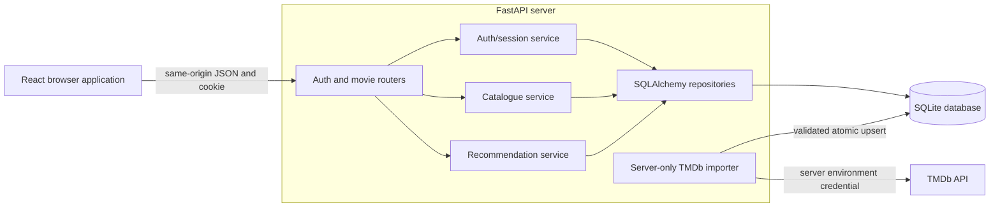
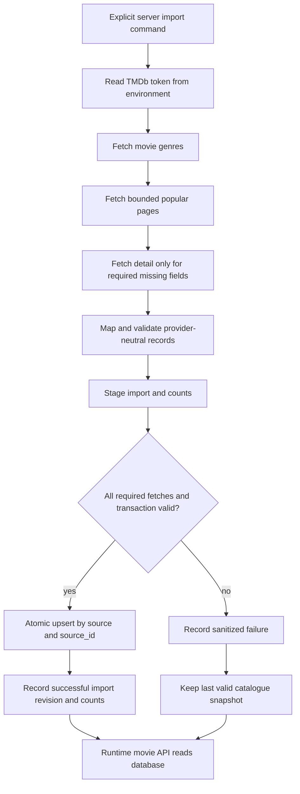

# M2 architecture baseline

This document is the local contract output for
[#69 / S2-C03](https://github.com/SE-FDA-NEU/ai66a_group3_C1_SE/issues/69).
It defines the target stack, ownership, module boundaries, authentication/data
rules, and TMDb import flow. The HTTP DTO contract is in [api.md](api.md).

Contract revision: `C03-DRAFT-1`.

`C03-DRAFT-1` is not an approved or merged revision. It becomes the frozen
contract only after an independent substantive review and merge. This document
does not claim that runtime code, tests, a review, a meeting, or a submission
already exists.

## 1. Verified repository state

The repository was inspected from base commit
`8b4bd1ebf7b18b47d75aae5694c0868edcf64bca`.

| Item | Verified state |
|---|---|
| Application source directories | None present; only repository configuration and documentation exist. |
| Python manifest | No `pyproject.toml`, `requirements.txt`, or `setup.py` exists. |
| Node manifest | No `package.json` or lockfile exists. |
| Database/migrations | No application database schema or migration directory exists. |
| Runtime commands | None can be truthfully reported as working yet. |
| CI runtime baselines | `.github/workflows/ci.yml` specifies Python 3.12 when a Python manifest exists and Node.js 20 when `package.json` exists. |
| Runtime bootstrap dependency | [#70 / S2-C04](https://github.com/SE-FDA-NEU/ai66a_group3_C1_SE/issues/70) is open and owns lockfiles, migrations, run/test commands, and a real database-backed route. |
| NLP decision dependency | [#43](https://github.com/SE-FDA-NEU/ai66a_group3_C1_SE/issues/43) is open with `Result: Pending`; its requested output file is not present. |
| Review evidence for #69 | Issue #69 currently has no completion evidence or review comment. |

The selected stack and paths below are therefore the C03 implementation
contract for C04, not a claim that those modules already exist. C04 must create
and verify them, then this document must be updated with the actual dependency
PR/SHA and observed commands before #69 closes.

## 2. Selected implementation stack

| Layer | C03 decision | Evidence boundary |
|---|---|---|
| Frontend runtime | Node.js 20 | The version is already configured in CI. |
| Frontend application | React, TypeScript, Vite, React Router | Selected here; packages and exact versions do not yet exist and must be locked by C04. |
| Backend runtime | Python 3.12 | The version is already configured in CI. |
| HTTP/API | FastAPI, Pydantic, Uvicorn | Selected here; packages and exact versions do not yet exist and must be locked by C04. |
| Persistence | SQLAlchemy, Alembic, SQLite | Selected for the M2 local/demo runtime; no migration has been created yet. |
| Password hashing | Argon2id through a maintained Python library | Selected contract; the exact package/version must be recorded in the C04 lockfile. |
| Provider HTTP | `httpx` in a server-only TMDb adapter | Selected contract; the browser must never receive the TMDb credential. |
| Tests | pytest for backend; Vitest and React Testing Library for frontend | Selected contract; no test suite currently exists. |

The integrated deployment is same-origin: FastAPI serves `/api` and the built
frontend, while Vite proxies `/api` to FastAPI during development. This avoids
cross-origin credential handling for the account cookie.

### Required runtime paths

These exact paths are the handoff contract to #70. The `Exists now` column is
deliberately explicit so a planned path is not misreported as an actual file.

| Module | Required path | Owner | Exists now |
|---|---|---|---|
| Python package and dependency configuration | `backend/pyproject.toml` | `@anotify-vie` (#70) | No |
| FastAPI application entry point | `backend/app/main.py` | `@anotify-vie` (#70) | No |
| Auth HTTP router | `backend/app/api/auth.py` | `@hoang3003` (#52, #54) | No |
| Movie HTTP router | `backend/app/api/movies.py` | `@kietxuan` (#60) | No |
| Auth service | `backend/app/services/auth.py` | `@NguyenTuanAnh0608` (#49, #53) | No |
| Catalogue service/repository | `backend/app/services/catalogue.py`, `backend/app/repositories/movies.py` | `@kietxuan` (#47) | No |
| TMDb adapter/import command | `backend/app/integrations/tmdb.py`, `backend/app/commands/import_tmdb.py` | `@kietxuan` (#48) | No |
| Database models and migrations | `backend/app/db/models.py`, `backend/alembic/` | Account/catalogue owners; bootstrap by `@anotify-vie` (#70) | No |
| Backend contract tests | `backend/tests/` | `@vu-huzy` (#51, #57, #62) | No |
| Frontend manifest | `frontend/package.json` | `@anotify-vie` (#70) | No |
| Frontend auth feature | `frontend/src/features/auth/` | `@anotify-vie` (#50, #55) | No |
| Frontend movie feature | `frontend/src/features/movies/` | `@anotify-vie` (#59, #61) | No |
| Architecture contract | `docs/architecture.md` | `@hoang3003` (#69) | Yes in this branch |
| HTTP/DTO contract | `docs/api.md` | `@hoang3003` (#69) | Yes in this branch |

### Required commands and verification status

The following command interface is selected for C04. None of the runtime
commands is runnable at the inspected base commit because its referenced
manifest/module is absent. A later PR must run each command and replace
`Not verified` with an observed result; this document does not invent one.

| Purpose | Required command from repository root | Current status |
|---|---|---|
| Install backend | `python -m pip install -e "./backend[dev]"` | Not verified; manifest absent |
| Apply migrations | `python -m alembic -c backend/alembic.ini upgrade head` | Not verified; configuration absent |
| Run backend | `python -m uvicorn app.main:app --app-dir backend --reload` | Not verified; module absent |
| Install frontend | `npm --prefix frontend ci` | Not verified; manifest/lockfile absent |
| Run frontend | `npm --prefix frontend run dev` | Not verified; manifest absent |
| Test backend | `python -m pytest backend/tests -v` | Not verified; tests absent |
| Test frontend | `npm --prefix frontend test` | Not verified; tests absent |
| Build frontend | `npm --prefix frontend run build` | Not verified; manifest absent |
| Check current documentation diff | `git diff --check` | Runnable now; the observed result for this branch is recorded only in the author handoff, not treated as runtime evidence |

## 3. Module ownership

Ownership below follows the current GitHub task assignees. It identifies the
primary coordinator; it does not authorize self-review or claim an independent
reviewer has accepted the work.

| Boundary | Primary owner | Current tasks |
|---|---|---|
| Architecture, API contract, registration/login/logout/me endpoints, protected-route backend | `@hoang3003` | #69, #52, #54, #56 |
| Account schema, password boundary, server sessions, cold-start ranking | `@NguyenTuanAnh0608` | #49, #53, #58, #66 |
| Catalogue storage, TMDb importer, movie list/detail API, attribution content | `@kietxuan` | #47, #48, #60, #63 |
| Auth/movie frontend and reproducible runtime bootstrap | `@anotify-vie` | #50, #55, #59, #61, #70 |
| Registration/auth/detail/explanation verification and M2 evidence | `@vu-huzy` | #51, #57, #62, #65, #71 |

Changes across boundaries require the affected owners to agree on this contract
before implementation. The independent reviewer for #69 is not currently
recorded and must not be inferred from ownership.

## 4. Target architecture

Routers translate HTTP only. Services enforce business rules. Repositories own
parameterized database access and transaction boundaries. The provider adapter
owns TMDb field names; application DTOs stay provider-neutral. Runtime movie
requests read the local database and never call TMDb.

## 5. Data and authentication policy

### Stored entities

| Entity | Required fields and constraints |
|---|---|
| `UserAccount` | Server-generated opaque string `id`; normalized email with a database unique constraint; password hash; no plaintext password. |
| `AuthSession` | Opaque random session identifier/digest, `user_id`, expiry, and invalidation timestamp. |
| `CatalogMovie` | Stable opaque internal `id`; `source`; `source_id`; title; nullable year/overview/popularity/vote fields; fetch timestamp; unique (`source`, `source_id`). |
| `Genre` and `MovieGenre` | Provider genre ID/name and a de-duplicated movie/genre relation. |
| `ViewerRating` | Composite identity (`user_id`, `movie_id`) and integer value 1-5. |
| `ImportRun` | Provider, status, timestamps, catalogue revision, and inserted/updated/rejected counts without credentials. |

### Email and password

- Registration trims surrounding email whitespace and lowercases the complete
  address before validation and storage. The normalized column is unique in the
  database; the unique constraint, not a pre-check alone, resolves concurrent
  duplicate registration.
- A duplicate normalized email returns exactly
  `This email is already registered`.
- A password must contain at least 8 characters. The server hashes it with
  Argon2id and stores only the encoded hash. Password and hash never appear in
  an API DTO or log.
- Registration creates the account but not an authenticated session; the UI
  opens `/login` after the API succeeds.

### Cookie session and authoritative user identity

- Successful login creates a cryptographically random opaque server session
  and returns it in an `ams_session` cookie with `HttpOnly`, `SameSite=Lax`,
  `Path=/`, and `Secure` outside localhost development.
- The server stores session state and invalidation. The browser does not store
  the session value in local storage and cannot decode account data from it.
- Every protected request resolves `user_id` from the authenticated cookie and
  server session. A client-supplied `user_id` in a body, query, path, or custom
  header is never authoritative.
- Unknown email and incorrect password return the same status and exact message:
  `Email or password is incorrect`.
- Successful login opens `/recommendations`. Logout invalidates the current
  server session, clears the cookie, and opens `/`.
- Preference, rating, reset, and personal recommendation queries must filter by
  the session-derived `user_id`, which prevents Account B from accessing
  Account A's data.

The exact request/response/error shapes are frozen in [api.md](api.md).

## 6. TMDb importer flow

### Import contract

- Only the server-side command calls TMDb. It reads
  `TMDB_READ_ACCESS_TOKEN` from the environment; the token is never committed,
  printed, stored in the database, or sent to the browser.
- The C03 bound is popular pages 1 through 5 using language `en-US`. This is a
  new contract decision, not a claim that an import has been run.
- The importer fetches the genre list and bounded popular pages, then requests
  a movie detail only when a required mapped field is missing.
- HTTP 401/403 fails without credential output. HTTP 429 respects
  `Retry-After`. Timeout, 429, and transient 5xx responses have bounded retry;
  automated tests use fake responses and never call live TMDb.
- Rows are validated before one atomic database transaction. A failed required
  fetch or transaction leaves the last valid catalogue unchanged. Test fixtures
  are never substituted into runtime data.
- Upsert key (`source`, `source_id`) preserves the stable internal movie ID on
  re-import. The run records inserted, updated, rejected, and timestamps; it
  does not record secrets.

### TMDb mapping

| TMDb input | Application field | Rule |
|---|---|---|
| `id` | `sourceId` | Convert to a string and upsert with `source = "tmdb"`; do not expose it as the internal movie ID. |
| `title` | `title` | Required; trim and reject a blank title. |
| `release_date` | `releaseYear` | Valid year or null. |
| `genre_ids[]` / detail `genres[]` | `genreIds`, `genreNames` | De-duplicate and map through stored genre records. |
| `overview` | `overview` | Trim; blank becomes null, not fabricated copy. |
| `popularity` | `popularityScore` | Finite number or null; never derive it from votes. |
| `vote_average` | `voteAverage` | External aggregate or null; never treat it as a user's rating. |
| `vote_count` | `voteCount` | Non-negative integer or null. |
| Fetch time | `sourceFetchedAt` | UTC timestamp recorded by the server. |

## 7. NLP gate before Sprint 4

The required NLP contract cannot yet be truthfully frozen. Issue #43 is open,
its result is explicitly `Pending`, and `docs/spike-nlp-text-similarity.md` does
not exist. Therefore this revision makes no claim about an approved NLP
language, library/version, preprocessing result, or fallback.

Before Sprint 4 text-ranking work starts, the reviewed Spike must add:

- actual language assumption and observed fixture inputs/results;
- selected library and locked version;
- text normalization/vectorization procedure;
- shared-genre eligibility and source-movie exclusion for similar movies;
- missing-overview and zero-vector behaviour;
- zero-positive-score response (`No movies found`) if accepted by the review;
- deterministic tie ordering; and
- review evidence and the accepted/revised/rejected recommendation.

Until then, no consumer PR may claim TF-IDF/cosine behaviour is approved or
implemented. Existing genre/popularity rules remain the only documented
runtime-independent fallback.

## 8. Review and merge gate

At this revision:

| Required evidence | Current truthful value |
|---|---|
| Actual output files | `docs/architecture.md` and `docs/api.md` exist only in the local working branch until committed/pushed. |
| Dependency PR/SHA | No C04 PR/SHA is recorded; only open dependency issue #70 is known. |
| DTO revision | `C03-DRAFT-1` |
| Independent reviewer | Not recorded or confirmed. |
| Substantive review | Not performed/linked. |
| Contract PR | Not opened. |
| Merge | Not performed. |

Do not close #69 until the runtime paths/commands are verified against the C04
PR/SHA, the NLP contract has its reviewed Spike evidence before Sprint 4, the
contract PR receives an independent substantive review, and the reviewed
documentation/configuration is merged.
