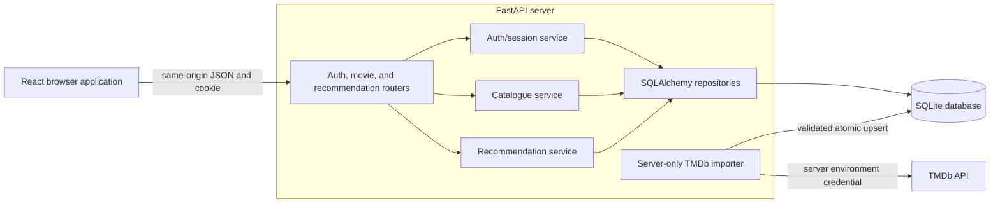
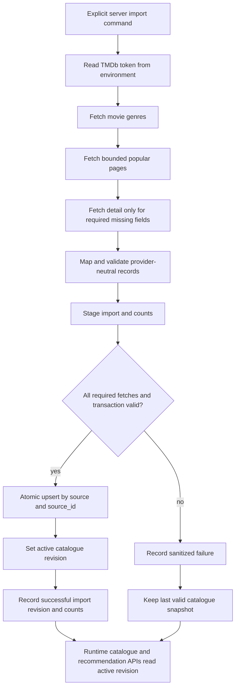

# M2 architecture baseline

This document is the local contract output for
[#69 / S2-C03](https://github.com/SE-FDA-NEU/ai66a_group3_C1_SE/issues/69).
It defines the target stack, ownership, module boundaries, authentication/data
rules, and TMDb import flow. The HTTP DTO contract is in [api.md](api.md).

Contract revision: `C03-DRAFT-1`.

`C03-DRAFT-1` remains a draft until it is merged. Live review, CI, and merge
status are tracked on the contract pull request rather than copied into this
document. Merge freezes this baseline for consumers; runtime verification and
the reviewed NLP addendum remain separate gates before #69 can close.

## 1. Verified repository state

The repository was inspected from base commit
`8b4bd1ebf7b18b47d75aae5694c0868edcf64bca`.

| Item | Verified state |
|---|---|
| Application source directories | None present; only repository configuration and documentation exist. |
| Python manifest | No `pyproject.toml`, `requirements.txt`, or `setup.py` exists. |
| Node manifest | No `package.json` or lockfile exists. |
| Database/migrations | No application database schema or migration directory exists. |
| Runtime commands | None can be truthfully reported as working yet. |
| CI runtime baselines | `.github/workflows/ci.yml` detects `backend/pyproject.toml` and `frontend/package.json`, then uses Python 3.12 and Node.js 24 respectively. Runtime jobs remain skipped until C04 adds those manifests. |
| Runtime bootstrap dependency | [#70 / S2-C04](https://github.com/SE-FDA-NEU/ai66a_group3_C1_SE/issues/70) is open and owns lockfiles, migrations, run/test commands, and a real database-backed route. |
| NLP decision dependency | [#43](https://github.com/SE-FDA-NEU/ai66a_group3_C1_SE/issues/43) is open with `Result: Pending`; its requested output file is not present. |
| Review and merge evidence | [PR #72](https://github.com/SE-FDA-NEU/ai66a_group3_C1_SE/pull/72) is the source of truth for the live review, CI, and merge status of this baseline. |

The selected stack and paths below are therefore the C03 implementation
contract for C04, not a claim that those modules already exist. C04 must create
and verify them, then this document must be updated with the actual dependency
PR/SHA and observed commands before #69 closes.

## 2. Selected implementation stack

| Layer | C03 decision | Evidence boundary |
|---|---|---|
| Frontend runtime | Node.js 24 LTS | Supported LTS line selected for C03/C04 and configured consistently in CI; Node.js 20 is EOL. See the [official release schedule](https://github.com/nodejs/Release#release-schedule). |
| Frontend application | React, TypeScript, Vite, React Router | Selected here; packages and exact versions do not yet exist and must be locked by C04. |
| Backend runtime | Python 3.12 | The version is already configured in CI. |
| HTTP/API | FastAPI, Pydantic, Uvicorn | Selected here; packages and exact versions do not yet exist and must be locked by C04. |
| Persistence | SQLAlchemy, Alembic, SQLite | Selected for the M2 local/demo runtime; no migration has been created yet. |
| Password hashing | Argon2id through a maintained Python library | Selected contract; the exact package/version must be recorded in the C04 lockfile. |
| Provider HTTP | `httpx` in a server-only TMDb adapter | Selected contract; the browser must never receive the TMDb credential. |
| Tests | pytest for backend; Vitest and React Testing Library for frontend | Selected contract; no test suite currently exists. |

The integrated deployment is same-origin: FastAPI serves `/api` and the built
frontend, while Vite proxies `/api` to FastAPI during development. This avoids
cross-origin credential handling for the account cookie.

### Required runtime paths

These exact paths are the handoff contract to #70. The `Exists now` column is
deliberately explicit so a planned path is not misreported as an actual file.

| Module | Required path | Owner | Exists now |
|---|---|---|---|
| Python package and dependency configuration | `backend/pyproject.toml` | `@anotify-vie` (#70) | No |
| FastAPI application entry point | `backend/app/main.py` | `@anotify-vie` (#70) | No |
| Auth HTTP router | `backend/app/api/auth.py` | `@hoang3003` (#52, #54) | No |
| Movie HTTP router | `backend/app/api/movies.py` | `@kietxuan` (#60) | No |
| Recommendation HTTP router | `backend/app/api/recommendations.py` | `@NguyenTuanAnh0608` (#58) | No |
| Auth service | `backend/app/services/auth.py` | `@NguyenTuanAnh0608` (#49, #53) | No |
| Catalogue service/repository | `backend/app/services/catalogue.py`, `backend/app/repositories/movies.py` | `@kietxuan` (#47) | No |
| Recommendation service | `backend/app/services/recommendations.py` | `@NguyenTuanAnh0608` (#58) | No |
| TMDb adapter/import command | `backend/app/integrations/tmdb.py`, `backend/app/commands/import_tmdb.py` | `@kietxuan` (#48) | No |
| Database models and migrations | `backend/app/db/models.py`, `backend/alembic/` | Account/catalogue owners; bootstrap by `@anotify-vie` (#70) | No |
| Backend contract tests | `backend/tests/` | `@vu-huzy` (#51, #57, #62) | No |
| Frontend manifest | `frontend/package.json` | `@anotify-vie` (#70) | No |
| Frontend auth feature | `frontend/src/features/auth/` | `@anotify-vie` (#50, #55) | No |
| Frontend movie feature | `frontend/src/features/movies/` | `@anotify-vie` (#59, #61) | No |
| Architecture contract | `docs/architecture.md` | `@hoang3003` (#69) | Yes in this branch |
| HTTP/DTO contract | `docs/api.md` | `@hoang3003` (#69) | Yes in this branch |

### Required commands and verification status

The following command interface is selected for C04. None of the runtime
commands is runnable at the inspected base commit because its referenced
manifest/module is absent. A later PR must run each command and replace
`Not verified` with an observed result; this document does not invent one.

| Purpose | Required command from repository root | Current status |
|---|---|---|
| Install backend | `python -m pip install -e "./backend[dev]"` | Not verified; manifest absent |
| Apply migrations | `python -m alembic -c backend/alembic.ini upgrade head` | Not verified; configuration absent |
| Run backend | `python -m uvicorn app.main:app --app-dir backend --reload` | Not verified; module absent |
| Install frontend | `npm --prefix frontend ci` | Not verified; manifest/lockfile absent |
| Run frontend | `npm --prefix frontend run dev` | Not verified; manifest absent |
| Test backend | `python -m pytest backend/tests -v` | Not verified; tests absent |
| Test frontend | `npm --prefix frontend test` | Not verified; tests absent |
| Build frontend | `npm --prefix frontend run build` | Not verified; manifest absent |
| Check current documentation diff | `git diff --check` | Runnable now; run it and record the observed result in the current PR handoff before merge |

### CI handoff requirement

The runtime manifests are intentionally nested, so C04 and CI must keep the
same paths and commands:

- Python detection uses `backend/pyproject.toml`; installation uses
  `python -m pip install -e "./backend[dev]"`; lint and pytest target `backend/`.
- Node detection uses `frontend/package.json`; CI uses Node.js 24 and the
  `npm --prefix frontend` install, lint, test, and build commands.
- A root-only manifest check is not an acceptable gate because it would report
  success while silently skipping both selected runtimes.

C04 must commit the lockfiles/manifests and demonstrate that a deliberately
failing backend and frontend test makes the corresponding CI job fail.

## 3. Module ownership

Ownership below follows the current GitHub task assignees. It identifies the
primary coordinator; it does not authorize self-review or claim an independent
reviewer has accepted the work.

| Boundary | Primary owner | Current tasks |
|---|---|---|
| Architecture, API contract, registration/login/logout/me endpoints, protected-route backend | `@hoang3003` | #69, #52, #54, #56 |
| Account schema, password boundary, server sessions, cold-start ranking | `@NguyenTuanAnh0608` | #49, #53, #58, #66 |
| Catalogue storage, TMDb importer, movie list/detail API, attribution content | `@kietxuan` | #47, #48, #60, #63 |
| Auth/movie frontend and reproducible runtime bootstrap | `@anotify-vie` | #50, #55, #59, #61, #70 |
| Registration/auth/detail/explanation verification and M2 evidence | `@vu-huzy` | #51, #57, #62, #65, #71 |

Changes across boundaries require the affected owners to agree on this contract
before implementation. Ownership never counts as independent review; the live
review record is maintained on PR #72.

## 4. Target architecture

Routers translate HTTP only. Services enforce business rules. Repositories own
parameterized database access and transaction boundaries. The provider adapter
owns TMDb field names; application DTO field names stay provider-neutral.
Runtime movie and recommendation requests read the local database and never
call TMDb.

## 5. Data and authentication policy

### Stored entities

| Entity | Required fields and constraints |
|---|---|
| `UserAccount` | Server-generated opaque string `id`; normalized email with a database unique constraint; password hash; no plaintext password. |
| `AuthSession` | Opaque random session identifier/digest, `user_id`, expiry, and invalidation timestamp. |
| `CatalogueRevision` | Server-generated opaque string `id`, provider, creation timestamp, and successful-import metadata. A revision is not runtime-visible unless `CatalogueState` points to it. |
| `CatalogueState` | Singleton row containing non-null `active_revision_id` after the first successful import and an update timestamp. The foreign key targets `CatalogueRevision.id`. |
| `CatalogMovie` | Stable opaque internal `id`; non-null `catalogue_revision_id`; `source`; `source_id`; title; nullable year/overview/popularity/vote fields; fetch timestamp; unique (`source`, `source_id`). |
| `Genre` and `MovieGenre` | Provider genre ID/name and a de-duplicated movie/genre relation. |
| `ViewerGenrePreference` | `user_id`, provider numeric `genre_id`, and a unique (`user_id`, `genre_id`) constraint. Both columns are foreign keys; a service transaction enforces 1-5 distinct genres when saving a preference set. |
| `ViewerRating` | Composite identity (`user_id`, `movie_id`), foreign keys to the account and movie, and an integer value constrained to 1-5. |
| `ImportRun` | Provider, status, timestamps, nullable `catalogue_revision_id`, and inserted/updated/rejected counts without credentials. Only a successful run can activate its revision. |

### Email and password

- Registration trims surrounding email whitespace and lowercases the complete
  address before validation and storage. The normalized column is unique in the
  database; the unique constraint, not a pre-check alone, resolves concurrent
  duplicate registration.
- A duplicate normalized email returns exactly
  `This email is already registered`.
- A password must contain at least 8 characters. The server hashes it with
  Argon2id and stores only the encoded hash. Password and hash never appear in
  an API DTO or log.
- Registration creates the account but not an authenticated session; the UI
  opens `/login` after the API succeeds.

### Cookie session and authoritative user identity

- Successful login creates a cryptographically random opaque server session
  and returns it in an `ams_session` cookie with `HttpOnly`, `SameSite=Lax`,
  `Path=/`, and `Secure` outside localhost development.
- The server stores session state and invalidation. The browser does not store
  the session value in local storage and cannot decode account data from it.
- Every protected request resolves `user_id` from the authenticated cookie and
  server session. A client-supplied `user_id` in a body, query, path, or custom
  header is never authoritative.
- Unknown email and incorrect password return the same status and exact message:
  `Email or password is incorrect`.
- Successful login opens `/recommendations`. Logout invalidates the current
  server session, clears the cookie, and opens `/`.
- Preference, rating, reset, and personal recommendation queries must filter by
  the session-derived `user_id`, which prevents Account B from accessing
  Account A's data.

The exact request/response/error shapes for the Sprint 2 endpoint scope are
frozen in [api.md](api.md). Later mutation endpoints require reviewed addenda.

### Preference, rating, and reset persistence

- Saving preferences validates 1-5 distinct existing provider genre IDs, then
  replaces only the current session-derived user's preference rows in one
  transaction. The client cannot select a different `user_id`.
- The unique (`user_id`, `genre_id`) constraint prevents duplicate preference
  rows. The 1-5 set-size rule is enforced by the service transaction because it
  spans multiple rows.
- A rating upsert uses (`user_id`, `movie_id`) as its identity, so one account
  has at most one current rating for a movie and another account's value is
  never returned as its own.
- A confirmed profile reset deletes `ViewerGenrePreference` and
  `ViewerRating` rows where `user_id` equals the current authenticated account,
  in one transaction. Cancellation performs no write; failure rolls back both
  deletes. The reset never deletes another account's data.
- These entities freeze the persistence and account-isolation boundary. Their
  HTTP mutation endpoints remain outside this Sprint 2 API table and must be
  added by the reviewed S01, S05a, and S11 sprint contracts.

### Active catalogue revision and runtime reads

- Every `CatalogMovie` row belongs to exactly one `CatalogueRevision` through
  `catalogue_revision_id`.
- Every runtime catalogue, detail, and recommendation query first resolves
  `CatalogueState.active_revision_id` and filters movie rows to that exact
  revision. Reads never infer the active revision from a timestamp or the most
  recent `ImportRun` row.
- The API `catalogueRevision` metadata is the same active revision ID used by
  the query. No active revision produces `503 CATALOGUE_UNAVAILABLE`; an active
  revision with zero matching rows produces a successful empty list.
- Rows left on an older revision are inactive and cannot appear in runtime
  results. They may be cleaned up after activation, but cleanup is not part of
  the activation transaction and cannot change the active result set.

## 6. TMDb importer flow

### Import contract

- Only the server-side command calls TMDb. It reads
  `TMDB_READ_ACCESS_TOKEN` from the environment; the token is never committed,
  printed, stored in the database, or sent to the browser.
- The C03 bound is popular pages 1 through 5 using language `en-US`. This is a
  new contract decision, not a claim that an import has been run.
- The importer fetches the genre list and bounded popular pages, then requests
  a movie detail only when a required mapped field is missing.
- HTTP 401/403 fails without credential output. HTTP 429 respects
  `Retry-After`. Timeout, 429, and transient 5xx responses have bounded retry;
  automated tests use fake responses and never call live TMDb.
- Rows are validated before one atomic database transaction. The transaction
  creates a candidate `CatalogueRevision`, upserts every accepted movie with
  that `catalogue_revision_id`, replaces its genre relations, and updates
  `CatalogueState.active_revision_id` only after all required writes succeed.
- A failed required fetch or transaction never activates the candidate
  revision, so the previous active revision and its runtime result set remain
  unchanged. Test fixtures are never substituted into runtime data.
- Upsert key (`source`, `source_id`) preserves the stable internal movie ID on
  re-import. Movies not present in the new bounded import retain an older
  revision marker and are excluded by active-revision queries. The run records
  its revision ID, inserted, updated, rejected, and timestamps; it does not
  record secrets.

### TMDb mapping

| TMDb input | Application field | Rule |
|---|---|---|
| `id` | `sourceId` | Convert to a string and upsert with `source = "tmdb"`; do not expose it as the internal movie ID. |
| `title` | `title` | Required; trim and reject a blank title. |
| `release_date` | `releaseYear` | Valid year or null. |
| `genre_ids[]` / detail `genres[]` | `genreIds`, `genreNames` | De-duplicate and map through stored genre records. |
| `overview` | `overview` | Trim; blank becomes null, not fabricated copy. |
| `popularity` | `popularityScore` | Finite number or null; never derive it from votes. |
| `vote_average` | `voteAverage` | External aggregate or null; never treat it as a user's rating. |
| `vote_count` | `voteCount` | Non-negative integer or null. |
| Fetch time | `sourceFetchedAt` | UTC timestamp recorded by the server. |

## 7. NLP gate before Sprint 4

The required NLP contract cannot yet be truthfully frozen. Issue #43 is open,
its result is explicitly `Pending`, and `docs/spike-nlp-text-similarity.md` does
not exist. Therefore this revision makes no claim about an approved NLP
language, library/version, preprocessing result, or fallback.

Before Sprint 4 text-ranking work starts, the reviewed Spike must add:

- actual language assumption and observed fixture inputs/results;
- selected library and locked version;
- text normalization/vectorization procedure;
- shared-genre eligibility and source-movie exclusion for similar movies;
- missing-overview and zero-vector behaviour;
- zero-positive-score response (`No movies found`) if accepted by the review;
- deterministic tie ordering; and
- review evidence and the accepted/revised/rejected recommendation.

Until then, no consumer PR may claim TF-IDF/cosine behaviour is approved or
implemented. Existing genre/popularity rules remain the only documented
runtime-independent fallback.

## 8. Review and merge gate

Live PR facts such as approval count, CI result, and merge state change over
time. PR #72 is the source of truth for those facts; this contract records only
the durable gates:

| Gate | Durable rule |
|---|---|
| Baseline contract | `docs/architecture.md`, `docs/api.md`, and affected CI configuration receive substantive review and are merged before consumers call `C03-DRAFT-1` frozen. |
| Runtime verification | #70 links the actual dependency PR/SHA and observed install, migration, run, test, and clean-clone results for the selected nested paths. |
| Catalogue safety | Tests prove that a failed import leaves `CatalogueState.active_revision_id` unchanged and that every runtime movie query filters by it. |
| Account isolation | Tests prove session-derived identity for protected reads/writes and current-account-only preference/rating reset behaviour. |
| NLP addendum | #43 supplies observed fixtures, language/library/version, preprocessing, fallback, deterministic ordering, and independent review before Sprint 4 text-ranking work begins. |

#69 remains open until the reviewed NLP addendum is merged. Closing #69 also
requires the baseline and runtime-verification gates above; approval or merge
of the baseline PR alone is not completion evidence for the broader chore.
