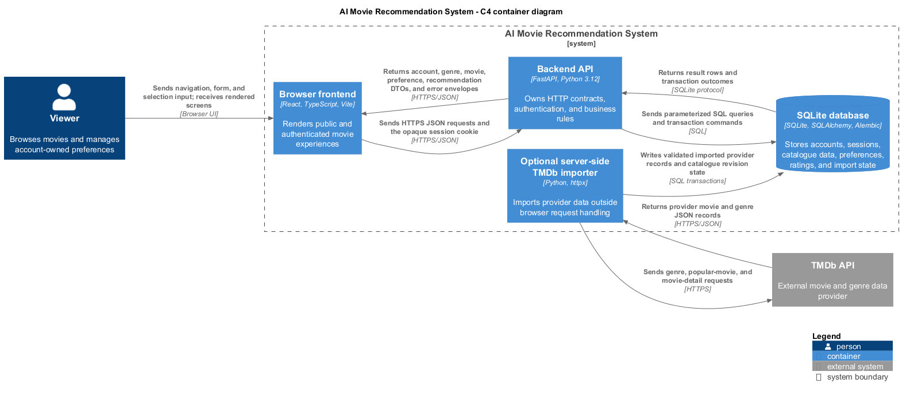
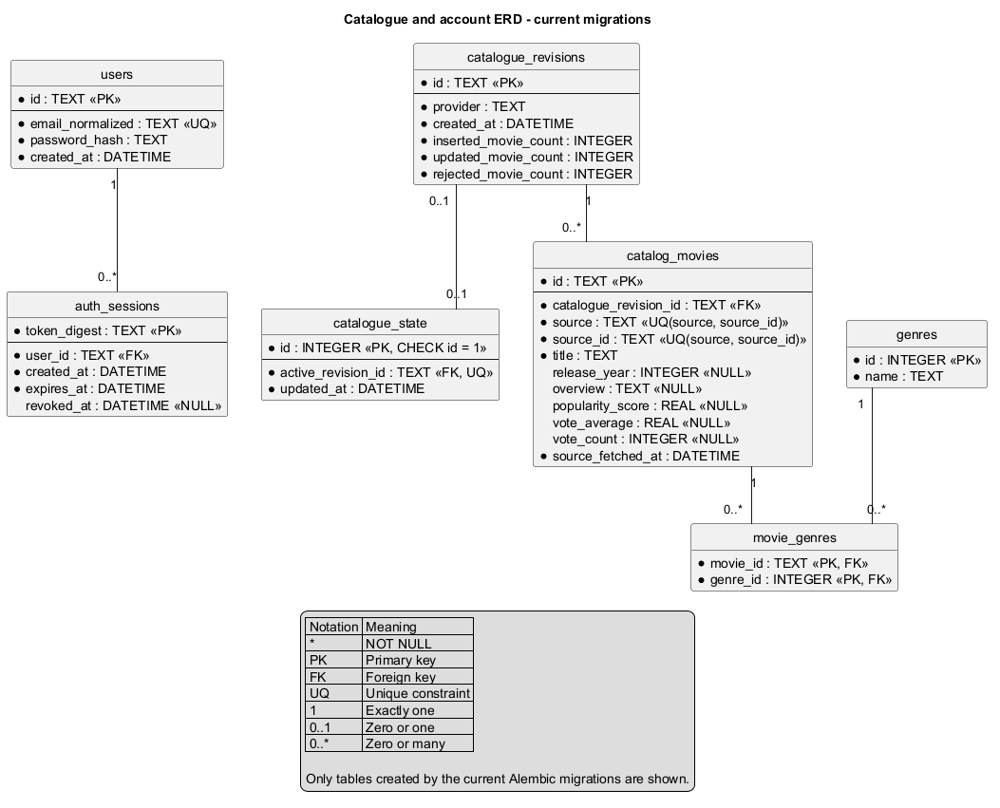
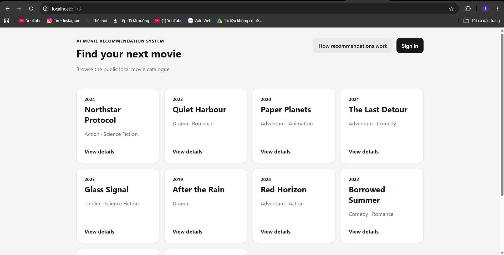

# Sprint 3 design and contract reconciliation

This document was reconciled with the local working tree on 2026-10-08. Every
table and endpoint is marked as implemented or as committed Sprint 3 scope
with implementation pending; no tested SHA or review approval is implied.
Request and response shapes are in
[api.md](api.md), UI state is in [ui.md](ui.md), and ownership/persistence is
in [architecture.md](architecture.md).

Sprint 3 decision update, 2026-10-06: TMDb is the required catalogue source for
development, staging and demos. The existing importer is reused; operational
readiness and verification are planned under
[#128](https://github.com/SE-FDA-NEU/ai66a_group3_C1_SE/issues/128) and
[#135](https://github.com/SE-FDA-NEU/ai66a_group3_C1_SE/issues/135).
Historical M2 seed screenshots/test results below remain M2 evidence, not a
claim that the Sprint 3 live import or acceptance has passed. See the tracked
[TMDb Sprint 3 runbook](tmdb-sprint3-runbook.md).

## 1. Architecture



PlantUML source: [images/architecture.puml](images/architecture.puml).

The diagram is historical M2 evidence and its importer label reflects the old
optional setup. The updated Sprint 3 source requirement is recorded in the
component table and ADR-1 below; topology and runtime read boundaries are unchanged.

The browser talks only to the backend API. The backend is the only component that reads or writes accounts and sessions. The TMDb importer is a separate command that never runs during a browser request, so movie pages read the local database and never call TMDb.

| Component | Technology | Responsibility |
|---|---|---|
| Browser frontend | React, TypeScript, Vite, React Router | Renders the public catalogue, movie detail, explanation, registration and sign-in pages, and the signed-in pages. Calls the backend through relative `/api` paths. |
| Backend API | Python 3.12, FastAPI, Pydantic | Validates input, resolves the session cookie to an account, applies the business rules, and returns DTOs and error envelopes. |
| SQLite database | SQLite, SQLAlchemy, Alembic | Stores accounts, sessions, and the movie catalogue. The backend turns on `PRAGMA foreign_keys` for every connection, so foreign keys are enforced. |
| TMDb importer | Python command, httpx | Required catalogue preparation for Sprint 3 dev/staging/demo. Fetches genres and one page of popular movies, writes a new revision, and activates it only after every write succeeds. |
| TMDb API | External service | Source of movie and genre data for the importer only. |

In development, Vite listens on port 5173 and proxies `/api` to the backend on `http://127.0.0.1:8000`, so the browser sees one origin. The backend does not serve the built frontend in M2, so the application runs as two processes. The session cookie is named `ams_session`; it is opaque, `HttpOnly` and `SameSite=Lax`.

### Modules and owners

Owners are the GitHub assignees of the Sprint 2 tasks.

| Module | What it does | Owner (task) |
|---|---|---|
| Catalogue storage and repository: `backend/app/db/models.py`, `backend/app/repositories/movies.py` | Stable internal movie IDs, the active-revision pointer, and the list and detail queries. | Nguyen Xuan Kiet, `@kietxuan` (#47) |
| M2 seed and bootstrap: `backend/app/catalogue/m2_seed.py`, `backend/app/cli/bootstrap_m2_catalogue.py` | One idempotent command that migrates the database and loads the 12-movie dataset. | `@kietxuan` (#74) |
| TMDb importer: `backend/app/integrations/tmdb.py`, `backend/app/catalogue/tmdb_import.py`, `backend/app/cli/import_tmdb_catalogue.py` | Server-side atomic catalogue import; required from Sprint 3. | `@kietxuan` (#48); S3 T29 setup, `@hoang3003` independent review |
| Account storage and password hashing: `backend/app/repositories/users.py`, `backend/app/security/passwords.py` | Users table access, email normalisation, Argon2id hashing. | Nguyen Tuan Anh, `@NguyenTuanAnh0608` (#49) |
| Server sessions: `backend/app/security/sessions.py` | Creates, resolves and revokes sessions. | `@NguyenTuanAnh0608` (#53) |
| Registration endpoint: `backend/app/schemas/auth.py`, `POST /api/auth/register` | Validates the email and password and creates the account. | Vu Quoc Huy, `@vu-huzy` (#52) |
| Login, logout, current account: `backend/app/main.py`, `backend/app/security/origin.py` | Sign-in and sign-out endpoints and the same-origin check. | Tran Minh Hoang, `@hoang3003` (#54) |
| Catalogue and detail endpoints: `GET /api/movies`, `GET /api/movies/{movieId}` | Public list and detail reads from the active catalogue. | `@vu-huzy` (#60) |
| Popular ranking: `backend/app/recommendations/ranker.py`, `GET /api/me/recommendations` | Shared popularity ordering and the signed-in cold-start list. | Tran Tuan Anh, `@anotify-vie` (#58) |
| Catalogue and detail pages: `frontend/src/pages/HomePage.tsx`, `MovieDetailPage.tsx` | Ten movie cards at `/` and the detail page at `/movies/:movieId`. | `@anotify-vie` (#61) |
| Registration and sign-in forms: `RegisterPage.tsx`, `LoginPage.tsx` | Forms that call the auth endpoints. | `@NguyenTuanAnh0608` (#50), `@anotify-vie` (#55) |
| Route guards and stale-account state: `frontend/src/auth/`, `frontend/src/protectedRoutes.tsx` | Redirects unsigned visitors to `/login` and clears account state on sign-out. | `@vu-huzy` (#56) |
| Recommendation landing and explanation pages: `RecommendationsPage.tsx`, `RecommendationExplanationPage.tsx` | The signed-in landing page and the public `/about-recommendations` page. | `@hoang3003` (#59, #64) |

## 2. Data model



PlantUML source: [images/erd.puml](images/erd.puml).

The database has seven application tables, created by three Alembic revisions on top of the empty bootstrap revision: `4bde7d96c1c2` (catalogue), `7f5b1d2a6e90` (users) and `8c1e2f4a7b90` (auth sessions). The single migration head is `8c1e2f4a7b90`.

The ERD in `docs/images/erd.png` matches the current M2 Alembic migrations. It shows only the seven migrated tables: `users`, `auth_sessions`, `catalogue_revisions`, `catalogue_state`, `catalog_movies`, `genres`, and `movie_genres`.

Preferences, ratings, personalised recommendation, and profile reset are not
represented as implemented tables. Sprint 3 freezes their contracts; rating-
adjusted ranking (Story #22 / S05b) is planned Sprint 4 rather than Sprint 3.

A trailing `?` marks a column that allows NULL. Every other column is NOT NULL.

| Table | Purpose | Columns and types | Primary key | Foreign keys | Constraints |
|---|---|---|---|---|---|
| `users` | Accounts | `id` VARCHAR(36), `email_normalized` VARCHAR(320) COLLATE NOCASE, `password_hash` VARCHAR(255), `created_at` DATETIME | `id` | None | UNIQUE `email_normalized` |
| `auth_sessions` | Server-side login sessions | `token_digest` VARCHAR(64), `user_id` VARCHAR(36), `created_at` DATETIME, `expires_at` DATETIME, `revoked_at` DATETIME? | `token_digest` | `user_id` to `users.id`, ON DELETE CASCADE, indexed | None |
| `catalogue_revisions` | One seeded or imported snapshot of the catalogue | `id` VARCHAR(36), `provider` VARCHAR(32), `created_at` DATETIME, `inserted_movie_count` INTEGER, `updated_movie_count` INTEGER, `rejected_movie_count` INTEGER | `id` | None | None |
| `catalogue_state` | The one row that names the active revision | `id` INTEGER, `active_revision_id` VARCHAR(36), `updated_at` DATETIME | `id` | `active_revision_id` to `catalogue_revisions.id`, ON DELETE RESTRICT | CHECK `id = 1`; UNIQUE `active_revision_id` |
| `catalog_movies` | Movies, each owned by one revision | `id` VARCHAR(36), `catalogue_revision_id` VARCHAR(36), `source` VARCHAR(32), `source_id` VARCHAR(128), `title` VARCHAR(500), `release_year` INTEGER?, `overview` TEXT?, `popularity_score` FLOAT?, `vote_average` FLOAT?, `vote_count` INTEGER?, `source_fetched_at` DATETIME | `id` | `catalogue_revision_id` to `catalogue_revisions.id`, ON DELETE RESTRICT, indexed | UNIQUE (`source`, `source_id`) |
| `genres` | Genres, keyed by the provider's genre ID | `id` INTEGER (not auto-incremented), `name` VARCHAR(100) | `id` | None | None |
| `movie_genres` | Links each movie to its genres | `movie_id` VARCHAR(36), `genre_id` INTEGER | (`movie_id`, `genre_id`) | `movie_id` to `catalog_movies.id`, ON DELETE CASCADE; `genre_id` to `genres.id`, ON DELETE RESTRICT | None |

Multiplicities:

- One user has zero or many `auth_sessions`; each session belongs to exactly one user.
- One revision has zero or many movies; each movie belongs to exactly one revision.
- `catalogue_state` holds exactly one row, and that row points at exactly one revision.
- Movies and genres are many-to-many through `movie_genres`; the composite primary key prevents a duplicate pair.

Committed Sprint 3 storage adds `user_genre_preferences` with composite key
`(user_id, genre_id)` and `viewer_ratings` with composite key
`(user_id, movie_id)`. Both columns in each key have foreign keys to the
application-owned user/catalogue records. `viewer_ratings.rating` has a
database check from 1 through 5. These tables and constraints do not exist in
the current migration head; [architecture.md](architecture.md) is the target
storage contract for their future migration.

### Business rules enforced in M2

| Rule | Database | Service or query | Tests |
|---|---|---|---|
| BR5: popular movies sort by popularity descending, then title A-Z, at most 10 | None | `popularity_title_id_ordering()` sorts by popularity (null last), then title, then ID. `limit` accepts 1 to 10. | `test_movies_api.py`, `test_popular_recommendations.py` |
| BR6: an unknown movie ID never shows another movie | `catalog_movies.id` is the primary key | Lookup by ID inside the active revision; a miss returns `404 MOVIE_NOT_FOUND` | `test_unknown_movie_id_returns_404` |
| BR13: the explanation lists exactly 3 steps | None | Page content in `RecommendationExplanationPage.tsx` | `test_recommendation_explanation_content.py`, `recommendation-explanation.test.tsx` |
| BR16: an email is unique after case-insensitive normalisation | UNIQUE `email_normalized` with NOCASE collation | The email is trimmed and lowercased; a duplicate returns `409 EMAIL_ALREADY_REGISTERED` | `test_registration.py`, `test_registration_verification.py`, `test_account_migration.py` |
| BR17: a password has at least 8 characters and is stored only as a hash | `users` has no plaintext password column | `RegisterRequest` requires 8 or more characters; `password_hash` holds an Argon2id hash | `test_passwords.py`, `test_registration_verification.py` |
| BR18: personal data needs a valid session and belongs to that account | `auth_sessions.user_id` references `users.id` | `/api/auth/me` and `/api/me/recommendations` take the account from the cookie only and return `401` without a valid session | `test_auth_sessions.py`, `test_auth_catalogue_handoff.py` |
| BR19: sign-out invalidates the session and keeps the account | `revoked_at` on the session row | `revoke_session` sets `revoked_at`; the user row is untouched | `test_logout_forbids_reusing_the_old_session_on_authenticated_api` |

BR1 to BR4, BR7 to BR12, BR14 and BR15 depend on preference, rating, search, similarity or reset features that are not built yet. BR8 needs the preference and rating tables, which do not exist.

Committed Sprint 3 delivery is narrower than that historical rule list:
BR1-BR4 use saved genres and local popularity, BR7 stores an optional 1-5
rating without using it for ranking, and BR14 freezes the authenticated reset
backend transaction. BR9 rating-adjusted ranking remains Sprint 4.

## 3. API design

Conventions:

- Product endpoints are under `/api`; the health check is `/health`.
- JSON field names use `camelCase`.
- A success body is `{ "data": ..., "meta": ... }`. An error body is `{ "error": { "code", "message", "requestId" } }`.
- The signed-in account comes only from the `ams_session` cookie. No endpoint accepts a user ID from the client.
- `POST /api/auth/login` and `POST /api/auth/logout` reject cross-origin browser requests with `403 ORIGIN_NOT_ALLOWED`.
- Committed preference, rating, and reset writes must extend the same-origin
  mechanism. The current middleware does not yet protect those nonexistent
  routes; this is a recorded implementation gap.
- Any database failure returns `503 SERVICE_UNAVAILABLE`.

| Story | Method and endpoint | Access | Input | Success | Errors | Status |
|---|---|---|---|---|---|---|
| Health | `GET /health` | Public | None | `200` with `status`, `database`, `migrationVersion` | `503 SERVICE_UNAVAILABLE` when the database or migration table cannot be read | Implemented in M2 |
| S12 | `POST /api/auth/register` | Public | `email`, `password` (8 or more characters) | `201` with `data.user` (`id`, `email`) | `400 VALIDATION_ERROR`, `409 EMAIL_ALREADY_REGISTERED` | Implemented in M2 |
| S13 | `POST /api/auth/login` | Public, same-origin | `email`, `password` | `200` with `data.user`; sets the session cookie | `400 VALIDATION_ERROR`, `401 INVALID_CREDENTIALS`, `403 ORIGIN_NOT_ALLOWED` | Implemented in M2 |
| S13 | `POST /api/auth/logout` | Cookie optional, same-origin | None | `204`; session revoked, cookie cleared | `403 ORIGIN_NOT_ALLOWED` | Implemented in M2 |
| S13 | `GET /api/auth/me` | Signed in | None | `200` with `data.user` | `401 AUTHENTICATION_REQUIRED` | Implemented in M2 |
| S03, S04 | `GET /api/movies?limit=10` | Public | `limit` 1 to 10, default 10 | `200` with `data.movies` and `meta` (`count`, `limit`, `catalogueRevision`) | `400 VALIDATION_ERROR`, `503 CATALOGUE_UNAVAILABLE` | Implemented in M2 |
| S03 | `GET /api/movies/{movieId}` | Public | Internal movie ID | `200` with `data.movie` | `404 MOVIE_NOT_FOUND`, `503 CATALOGUE_UNAVAILABLE` | Implemented in M2 |
| S02, S04 | `GET /api/me/recommendations?limit=10` | Signed in | `limit` 1 to 10, default 10 | `200` with the popular list, `mode` `popular`, `personalised` `false` | `400 VALIDATION_ERROR`, `401 AUTHENTICATION_REQUIRED`, `503 CATALOGUE_UNAVAILABLE` | Implemented in M2 (popular list only) |
| S01 | `GET /api/genres` | Signed in | None | `200` with the local canonical genre list | `401 AUTHENTICATION_REQUIRED`, `503 CATALOGUE_UNAVAILABLE`, `503 SERVICE_UNAVAILABLE` | Committed Sprint 3 contract; implementation pending |
| S01 | `GET /api/me/preferences` | Signed in | None | `200` with the saved genres | `401 AUTHENTICATION_REQUIRED`, `503 SERVICE_UNAVAILABLE` | Committed Sprint 3 contract; implementation pending |
| S01 | `PUT /api/me/preferences` | Signed in, same-origin | `genreIds`: 1 to 5 distinct genre IDs | `200` with the saved genres after commit | `400 VALIDATION_ERROR`, `401 AUTHENTICATION_REQUIRED`, `403 ORIGIN_NOT_ALLOWED`, `404 GENRE_NOT_FOUND`, `503 SERVICE_UNAVAILABLE` | Committed Sprint 3 contract; implementation pending |
| S05a | `GET /api/me/ratings/{movieId}` | Signed in | Opaque movie ID | `200` with committed `rating` or `null` | `401 AUTHENTICATION_REQUIRED`, `404 MOVIE_NOT_FOUND` | Committed Sprint 3 contract; implementation pending |
| S05a | `PUT /api/me/ratings/{movieId}` | Signed in, same-origin | Strict `{ "rating": 1..5 }` | `200` only after commit | `400 VALIDATION_ERROR`, `401 AUTHENTICATION_REQUIRED`, `403 ORIGIN_NOT_ALLOWED`, `404 MOVIE_NOT_FOUND`, `503 SERVICE_UNAVAILABLE` | Committed Sprint 3 contract; implementation pending |
| S11 | `POST /api/me/profile/reset` | Signed in, same-origin | Exact `{ "confirm": true }` | `200` only after preferences/ratings delete transaction commits | `400 VALIDATION_ERROR`, `401 AUTHENTICATION_REQUIRED`, `403 ORIGIN_NOT_ALLOWED`, `503 SERVICE_UNAVAILABLE` | Committed Sprint 3 backend contract; implementation pending |

All six P0 Stories appear in the table: S01 (genres and preferences), S02 and S04 (recommendations and the movie list), S03 (movie detail), S12 (register) and S13 (sign-in, sign-out, current account). The S01 contracts are committed Sprint 3 scope with implementation pending. The recommendation endpoint returns the popular list for every signed-in account; genre-based ranking depends on the committed preference contracts. The `/recommendations` page does not display this response yet; the T20 evidence records that gap.

Error codes returned by the running backend:

| Code | HTTP status | Returned when |
|---|---:|---|
| `VALIDATION_ERROR` | 400 | A body field or the `limit` query value is invalid |
| `AUTHENTICATION_REQUIRED` | 401 | A signed-in endpoint has no valid, unexpired, unrevoked session |
| `INVALID_CREDENTIALS` | 401 | The email is unknown or the password is wrong; the message is the same for both |
| `ORIGIN_NOT_ALLOWED` | 403 | A login or logout request fails the same-origin check |
| `MOVIE_NOT_FOUND` | 404 | The movie ID does not exist in the active catalogue |
| `EMAIL_ALREADY_REGISTERED` | 409 | The normalised email is already stored |
| `SERVICE_UNAVAILABLE` | 503 | The database could not be read or written |
| `CATALOGUE_UNAVAILABLE` | 503 | No active catalogue revision exists |

`GENRE_NOT_FOUND` (404) belongs to the committed preference contract and is not
returned yet. Sprint 3 invalid preference/rating/reset bodies reuse the
implemented `VALIDATION_ERROR` convention; no rating/reset-specific error code
is invented.

## 4. Walking skeleton

The route is the browser page `/`. It calls `GET /api/movies?limit=10`, which reads `catalog_movies` (with `genres` and `movie_genres`) for the revision named in `catalogue_state`. The page shows the ten movies the database returns, and nothing is hard-coded in the frontend.

### Historical M2 bootstrap

From the repository root, with the virtual environment active and `.env` copied from `.env.example`:

This historical seed path is retained for M2 reproduction/test/offline support
in a separate database. Sprint 3 requires migration followed by TMDb import and
manual provenance smoke; do not activate the seed on its accepted database.

```bash
python -m app.cli.bootstrap_m2_catalogue
```

The command creates the database folder, applies every migration and loads the fixed local dataset. It does not read `TMDB_READ_ACCESS_TOKEN` and makes no network request. Output on a new database:

```text
M2 catalogue bootstrap complete
active_revision=375578bb-f998-4be5-b7ea-732d6a00e56c
movies=12
genres=8
movie_genres=22
```

The revision ID is generated and differs on every new database. A second run printed the same revision and counts.

### Database query

```sql
SELECT m.title, m.release_year, m.popularity_score
FROM catalog_movies AS m
JOIN catalogue_state AS s ON s.active_revision_id = m.catalogue_revision_id
WHERE s.id = 1
ORDER BY (m.popularity_score IS NULL), m.popularity_score DESC, m.title ASC, m.id ASC
LIMIT 10;
```

Result on the database above:

| Title | Year | Popularity |
|---|---:|---:|
| Northstar Protocol | 2024 | 98.0 |
| Quiet Harbour | 2022 | 92.0 |
| Paper Planets | 2020 | 90.0 |
| The Last Detour | 2021 | 90.0 |
| Glass Signal | 2023 | 88.0 |
| After the Rain | 2019 | 85.0 |
| Red Horizon | 2024 | 84.0 |
| Borrowed Summer | 2022 | 80.0 |
| Echo Room | 2021 | 78.0 |
| Orbit of Us | 2020 | 75.0 |

The API returns the same ten titles in the same order: `GET /api/movies?limit=10` gave `200` with `meta.count` 10 and `meta.limit` 10. `GET /api/movies/{id}` for Northstar Protocol gave `200`. An unknown ID gave `404 MOVIE_NOT_FOUND`, and `limit=11` gave `400 VALIDATION_ERROR`. One of the 12 movies, `Archive 17`, has no release year; its detail page shows `Information unavailable`.

### Screenshot



The catalogue page at `http://localhost:5173/` in a browser. Eight of the ten cards are visible; the other two are below the fold. The steps and the other screenshots (valid detail, unknown movie, incomplete record) are in [evidence/m2-evidence/README.md](evidence/m2-evidence/README.md).

### Checks

Run on `4bfae7c`, Windows 11, Python 3.12.10, Node.js 24.21.0, with `TMDB_READ_ACCESS_TOKEN` empty:

| Command | Result |
|---|---|
| `python -m pytest backend/tests -v` | 100 passed, 2 skipped |
| `python -m ruff check backend` | All checks passed |
| `npm --prefix frontend test` | 5 test files, 41 tests passed |
| `npm --prefix frontend run lint` | Exit code 0 |
| `npm --prefix frontend run build` | Exit code 0 |

The two skipped backend tests are placeholders for criteria that are not built yet; the pending criteria are listed in [evidence/t20-handoff/README.md](evidence/t20-handoff/README.md). The backend suite needs a migrated database, because `test_health` reads the migration table. `test_seed_service_never_needs_a_network_connection` replaces network connection creation with a function that fails, and it passes. The CI workflow sets the TMDb token to an empty string and has no importer step.

## 5. ADRs

### ADR-1: Where the running application reads movie data from

Status: accepted runtime boundary; catalogue-source decision updated for Sprint 3 on 2026-10-06. Sources: the movie-data Spike (#16), tasks #48/#74, and planned S3 T29/C04 readiness checks.

Context. M2 required a token-free deterministic walking skeleton. From Sprint 3 the team requires real TMDb catalogue data in development, staging and demos, while automated tests remain deterministic and credential-free.

Options considered:

1. The browser calls TMDb directly. The token would reach the browser; the Spike lists this as a risk.
2. The backend calls TMDb on each catalogue request. Page content and test results would depend on a live service whose popularity values change between runs.
3. The backend reads only the local database, and a separate command fills it, either from a fixed local dataset or from TMDb.

Decision. Option 3 remains the runtime boundary. From Sprint 3, the server-side importer is mandatory catalogue preparation: configure a private Read Access Token, migrate a fresh database and import TMDb before dev/staging/demo acceptance. Active revision provider and movie source must be `tmdb`, with source IDs, counts and fetch/import timestamps verified by a separate manual smoke. The importer activates a revision only after every write succeeds; failed imports preserve the previous valid catalogue and do not fall back to seed. Required setup/failure checks must be completed under T29/C04; this document does not claim that acceptance has passed.

Rationale. TMDb supplies the application catalogue, while local reads keep user requests independent of provider availability. Synthetic provider fixtures, boundary mocks and isolated test databases keep automated AC tests deterministic without live tokens/network. Credentials remain server-side.

Consequence. The M2 fixed dataset is only historical/test/labelled offline support, not Sprint 3 acceptance data. A missing token or failed import leaves a new demo environment unready. On an existing environment the valid previous snapshot remains readable; the failed attempt cannot be reported as successful readiness evidence. `/api/genres`, recommendations, public popular and details continue to read SQLite; source provenance stays in operator evidence, not new public secret/source-ID DTO fields. Media T26–T28 remain stretch and do not block unchanged S03 criteria.

Verification. T29 and C04 must link successful fresh-database import, credential/error guidance, rollback/idempotence checks and final-candidate live smoke outside CI. Existing M2 tests/evidence do not imply these checks have passed. The [runbook](tmdb-sprint3-runbook.md) contains the required commands and provenance checklist.

### ADR-2: How the server recognises a signed-in account

Status: accepted. Sources: the C03 contract ([architecture.md](architecture.md), [api.md](api.md)) and task #53.

Context. Signed-in pages and endpoints need to know the account, and sign-out has to stop the old credential from working.

Options considered:

1. A bearer token (for example a signed token) that the browser stores and sends in a header.
2. An opaque random value in an `HttpOnly` cookie, mapped to a session row on the server.

Decision. Option 2. The cookie value is 32 random bytes from `secrets.token_urlsafe`. The database stores only its SHA-256 digest. A session expires after 7 days and sign-out sets `revoked_at`. A successful login revokes the session named by any existing cookie and issues a new one.

Rationale. The contract rules out tokens in browser storage. The server can revoke a session itself: the T20 test replays the old cookie after sign-out from a new client and gets `401` on `/api/auth/me` and `/api/me/recommendations`.

Consequences. Every protected request reads a session row. Browsers attach cookies automatically, so the cookie uses `SameSite=Lax` and the backend checks `Sec-Fetch-Site` or `Origin` on login and logout. That check covers only those two endpoints; the committed preference, rating, and reset writes are not covered because they do not exist yet.

What would change the decision. A client that is not a browser, or a frontend served from a different origin than the API.

## 6. Changes since M1

### Change 1: The M2 catalogue comes from a local dataset, not from TMDb

Historical M2 decision; superseded for Sprint 3 dev/staging/demo by ADR-1 above.

Before. The M1 Spike (#16) chose TMDb as the catalogue provider and kept only a small local fixture for tests.

After. The M2 backend reads a fixed 12-movie dataset loaded by `python -m app.cli.bootstrap_m2_catalogue`. The TMDb importer was merged separately (task #48, PR #90) as an optional command.

Reason. The M2 requirement is a clean clone that runs without external credentials. Task #74 forbids a TMDb token or network request in the seed.

Impact in M2. The ten cards on `/` used fixed local titles and the importer was tested with mocked provider responses. These historical results do not establish Sprint 3 live-import readiness.

### Change 1b: TMDb catalogue is mandatory from Sprint 3

Decision date: 2026-10-06. Development/staging/demo catalogue preparation now
requires a configured server token, successful bounded import and verified TMDb
provenance. CI remains synthetic, isolated and token-free. T29 owns the required
setup foundation; C04 independently verifies clean clone and final-candidate
smoke. Account data and runtime SQLite reads retain their existing boundaries;
original Story criteria/points and separate media commitments are unchanged.

### Change 2: Sessions are stored as a digest with an expiry

Before. The M1 data contract in the Spike lists an `AuthSession` with an opaque `id`, a `userId` and an `invalidatedAt` field.

After. `auth_sessions` is keyed by `token_digest`, the SHA-256 digest of the cookie value, and has `expires_at` and `revoked_at`.

Reason. Task #53 requires that expired or invalid sessions return `401` and that login renews the session identity. Storing only the digest means the database never holds a value that a browser could send as a cookie.

Impact. A copy of the database holds no cookie value that a browser could send, and a cookie that was signed out or has expired returns `401`. The ERD in `docs/images/erd.png` shows `token_digest` and `revoked_at`.

## 7. Sprint 3 personalisation decisions

### ADR-3: Account identity and transaction boundary

Status: committed Sprint 3 contract; implementation pending.

Preferences, ratings, and reset are account-owned operations. Their target
user is resolved only from the valid `ams_session` row. Request bodies do not
accept `user_id`, account ID, email, username, or owner ID. Missing, expired,
or revoked sessions return `401` before private data is returned or changed,
and state-changing browser requests must pass the existing same-origin policy.

Preference replacement, rating upsert, and profile reset each return success
only after commit. Reset deletes the current user's preference and rating rows
in the same transaction; either failure rolls back both. The user, current
session, catalogue, movies, genres, and other accounts remain untouched.

### ADR-4: Sprint 3 recommendation inputs

Status: committed Sprint 3 contract; implementation pending.

Sprint 3 personalised ranking uses only saved genres and local catalogue
popularity. It preserves `data.movies`, `mode` (`personalised` or `popular`),
`personalised`, `noMatch`, and per-movie `reason.matchedGenres`. Ratings may be
stored by S05a but do not alter recommendation order in Sprint 3.
Rating-adjusted ranking belongs to Story #22 / S05b and is planned Sprint 4.

## 8. UI-driven design changes with repository evidence

### Stale response isolation

1. UI problem: a catalogue/detail request may finish after navigation, and an
   authenticated request may finish after logout or an account switch.
2. An unkeyed component/request result could display the previous movie or
   previous account's private state.
3. Current UI code cancels catalogue/detail state writes on effect cleanup,
   keys the protected subtree by `auth.user.id`, and centralises a protected
   API `401` transition through `handleUnauthorized`. Sprint 3 extends this
   rule to preference/rating/recommendation/reset requests by keying them with
   account ID and, for ratings, movie ID.
4. A delayed response is accepted only when its captured account/movie key and
   request generation still match current state; otherwise it is ignored.
5. This does not change M2 API payloads. It constrains client state ownership
   and preserves public catalogue/detail behaviour.

Evidence: `frontend/src/pages/HomePage.tsx` and `MovieDetailPage.tsx` use effect
cleanup cancellation; `frontend/src/auth/AuthContext.tsx` owns account
identity; `RequireAuth.tsx` keys protected content by `user.id`.

### Nullable catalogue fields for renderable detail states

The detail UI must remain usable when provider data lacks a release year or
overview. The current migration/model allow those fields to be null, DTOs
return JSON `null`, and the detail UI renders `Information unavailable` while
keeping the other fields visible. This is an evidence-backed data/UI
reconciliation, not a proposed backdrop change. Clients that assumed non-null
values must accept the already-documented nullable contract.

Evidence: migration `4bde7d96c1c2`, `MovieDetailDto`,
`MovieDetailPage.tsx`, and `test_movie_detail_returns_genres_and_treats_missing_fields_as_null`.

## 9. Backdrop reconciliation

No `backdrop` column, nullable-backdrop migration, TMDb backdrop mapping, DTO
field, detail compatibility code, or related test exists in the current
repository. No repository evidence maps issues #129-#131 to completed work.
Backdrop work therefore remains pending/stretch and is not described as
implemented.

## 10. D1 contract publication and consumer handoff

The initial contract milestone is prepared in this local working tree. D1 is
not considered published or reviewed until the documentation change has a real
review record. Once reviewed, implementation consumers may use it without
waiting for the final reconciliation gate.

Initial consumers/dependencies:

- [#103](https://github.com/SE-FDA-NEU/ai66a_group3_C1_SE/issues/103)
- [#106](https://github.com/SE-FDA-NEU/ai66a_group3_C1_SE/issues/106)
- [#108](https://github.com/SE-FDA-NEU/ai66a_group3_C1_SE/issues/108)
- [#112](https://github.com/SE-FDA-NEU/ai66a_group3_C1_SE/issues/112)
- [#128](https://github.com/SE-FDA-NEU/ai66a_group3_C1_SE/issues/128)
- T30-T35: `Issue link pending creation`; replace each placeholder only after
  its real GitHub issue exists.

Consumer ownership/handoff:

- Shared recommendation cards/client/container integration:
  [S3-T10 #112](https://github.com/SE-FDA-NEU/ai66a_group3_C1_SE/issues/112).
- No-match error, retry, and request-race handling:
  [S3-T11 #113](https://github.com/SE-FDA-NEU/ai66a_group3_C1_SE/issues/113).
- Cold-start transitions after preference save:
  [S3-T13 #115](https://github.com/SE-FDA-NEU/ai66a_group3_C1_SE/issues/115).
- TMDb import/setup:
  [#128](https://github.com/SE-FDA-NEU/ai66a_group3_C1_SE/issues/128).
- API/data contract:
  [#134](https://github.com/SE-FDA-NEU/ai66a_group3_C1_SE/issues/134).
- Clean-clone/offline CI:
  [#135](https://github.com/SE-FDA-NEU/ai66a_group3_C1_SE/issues/135).
- M3 UI dossier coordination: the UI-driven explanation in `docs/ui.md` and
  this design update must appear together in the same reviewed change for
  [S3-C05 #136](https://github.com/SE-FDA-NEU/ai66a_group3_C1_SE/issues/136).

These links assign handoff only. They do not imply completion, review approval,
test evidence, or a tested SHA.

## 11. Final reconciliation gate

| Gate | Current status | Evidence needed before completion |
|---|---|---|
| Initial API/database/UI contract | Prepared locally; review/publication pending | Reviewed D1 contract link |
| Preferences and personalised recommendation implementation | Pending; not present in current source/migrations | Merged code, migrations, executable tests, and consumer verification |
| Rating storage/API/UI protection | Committed Sprint 3 scope; implementation pending | T30-T34 issue links, merged implementation, isolation/validation/transaction/UI tests |
| Authenticated reset backend | Committed Sprint 3 scope; implementation pending | T35 issue link, merged transaction/rollback/security tests |
| UI-driven design reconciliation | Documented locally; #136 coordination/review pending | Same reviewed change containing `docs/ui.md` and `docs/design.md` |
| Backdrop #129-#131 | Conditional and pending; no shipped repository evidence | Reconcile only if nullable storage, migration/import, detail compatibility, and independent verification ship |
| Final implementation reconciliation | Pending | Compare these contracts with merged implementation and verification evidence |
| Final evidence | Pending | Reviewed contract links, actual implementation evidence, final test results, and real tested SHA |

Do not replace a `Pending` status with completion until the named repository
evidence exists. This local contract update is not a reviewed publication and
does not manufacture implementation results or a SHA.
