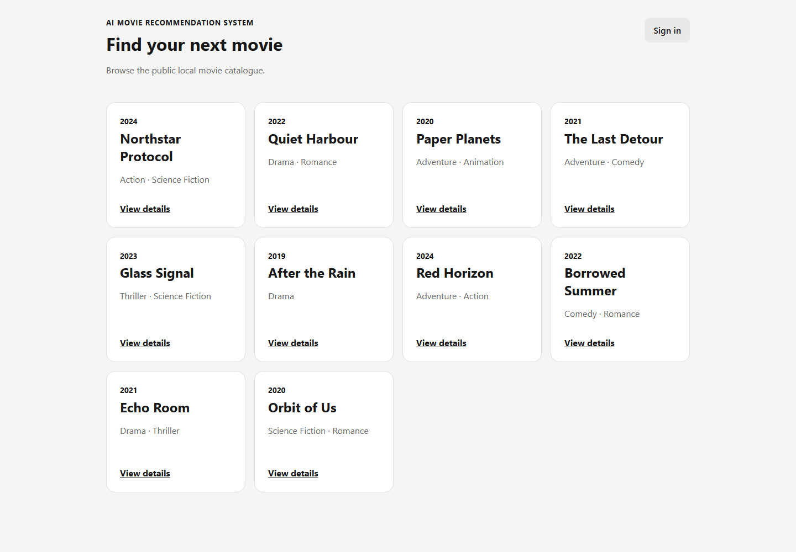
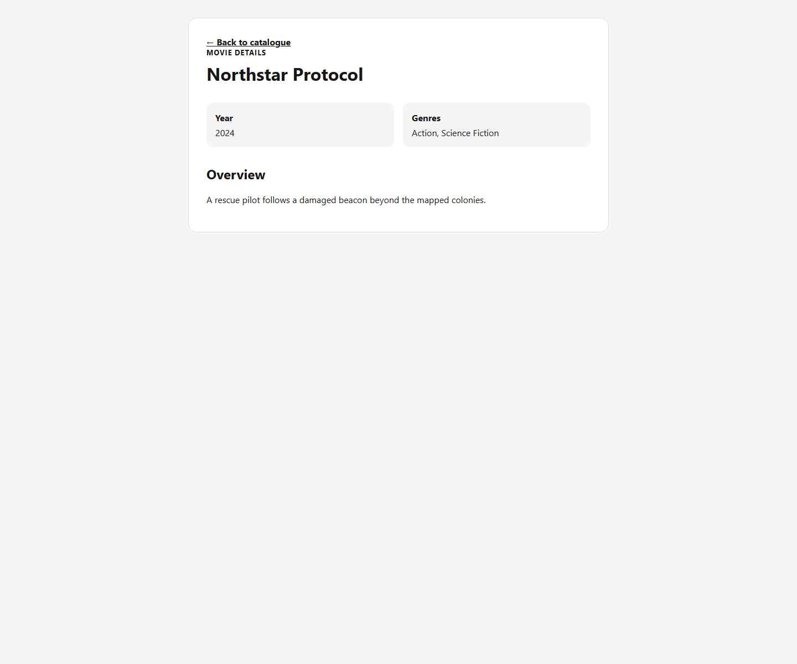
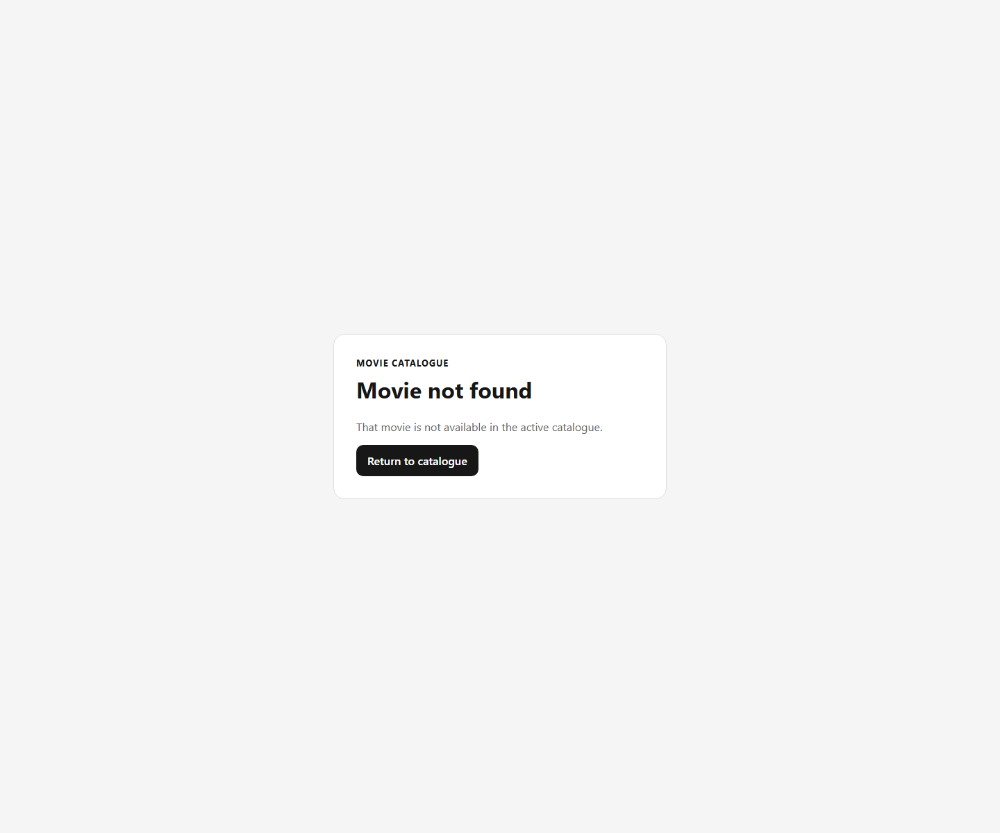
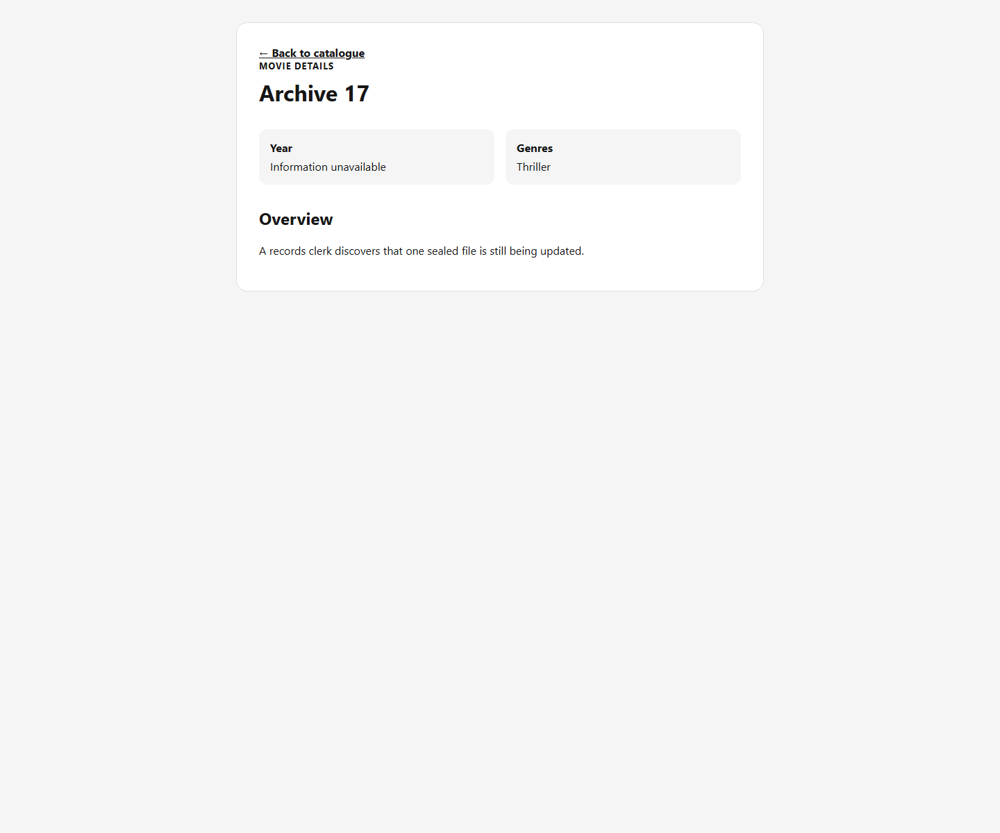

# S2-T16 M2 database-backed walking-skeleton evidence

Test date: 2026-10-01 (Asia/Saigon)

- Related task: [#62](https://github.com/SE-FDA-NEU/ai66a_group3_C1_SE/issues/62)
- Parent story: [#19](https://github.com/SE-FDA-NEU/ai66a_group3_C1_SE/issues/19) (reference only; do not close the Story)
- Tested commit: [`5f215d9887361d9c5d15e0599a7fc5a6ad479f58`](https://github.com/SE-FDA-NEU/ai66a_group3_C1_SE/commit/5f215d9887361d9c5d15e0599a7fc5a6ad479f58)

## Clean bootstrap and database count

A new application-data directory was created specifically for this run. It contained zero files before bootstrap.

```powershell
$env:DATABASE_URL = "sqlite:///./data/t16-evidence-5f215d9/app.db"
$env:TMDB_READ_ACCESS_TOKEN = ""
.\.venv\Scripts\python.exe -m app.cli.bootstrap_m2_catalogue
```

Actual output:

```text
Pre-bootstrap file count: 0
M2 catalogue bootstrap complete
active_revision=ee6a4424-5d86-416f-8d2e-efae4065a937
movies=12
genres=8
movie_genres=22
Bootstrap exit code: 0
```

The command created `data/t16-evidence-5f215d9/app.db` (81,920 bytes). A direct query against this database returned:

```text
Movie count: 12
Active movie count: 12
```

The database and browser profile were disposable test artifacts and were removed after verification. They are not part of the evidence files.

## Catalogue API

The backend was run against that same newly bootstrapped database:

```powershell
$env:DATABASE_URL = "sqlite:///./data/t16-evidence-5f215d9/app.db"
$env:TMDB_READ_ACCESS_TOKEN = ""
.\.venv\Scripts\python.exe -m uvicorn app.main:app --app-dir backend --host 127.0.0.1 --port 8000
```

Actual request and result:

```text
GET http://127.0.0.1:8000/api/movies?limit=10
200 OK
Catalogue records returned: 10
meta.count: 10
meta.limit: 10
catalogueRevision: ee6a4424-5d86-416f-8d2e-efae4065a937
```

The ten records were `Northstar Protocol`, `Quiet Harbour`, `Paper Planets`, `The Last Detour`, `Glass Signal`, `After the Rain`, `Red Horizon`, `Borrowed Summer`, `Echo Room`, and `Orbit of Us`.

## Browser catalogue

The frontend was started with:

```powershell
npm.cmd --prefix frontend run dev -- --host 127.0.0.1 --port 5173
```

Opening `http://localhost:5173/` displayed exactly ten movie cards:



The frontend requested `/api/movies?limit=10` through the Vite proxy. The live backend access log included:

```text
GET /api/movies?limit=10 HTTP/1.1 200 OK
```

The network request, matching catalogue revision, and deterministic database titles demonstrate that the cards came through the API rather than from hard-coded frontend data.

## Movie-detail behaviour

### Valid movie record

```text
GET /api/movies/1de23850-cf02-4f4c-8754-9d4574637b8c
200 OK
title: Northstar Protocol
releaseYear: 2024
genres: Action, Science Fiction
overview: A rescue pilot follows a damaged beacon beyond the mapped colonies.
```



### Unknown movie

```text
GET /api/movies/does-not-exist
404 Not Found
error.code: MOVIE_NOT_FOUND
error.message: Movie not found
```



### Incomplete movie record

The deterministic dataset contains `Archive 17`, whose `releaseYear` is `null`, and `Unfinished Map`, whose `overview` is `null`. Both detail API calls returned `200 OK`. The frontend displayed `Information unavailable` for the missing year without crashing:



## Automated tests

Focused backend command:

```powershell
.\.venv\Scripts\python.exe -m pytest backend/tests/test_m2_catalogue_bootstrap.py backend/tests/test_movies_api.py -v --basetemp data/t16-evidence-5f215d9/pytest-focused -p no:cacheprovider
```

Result:

```text
13 passed, 1 warning in 6.93s
```

Focused frontend command:

```powershell
npm.cmd --prefix frontend test -- src/tests/movies.test.tsx --reporter=verbose
```

Result:

```text
Test Files  1 passed (1)
Tests       6 passed (6)
Duration    1.74s
```

Coverage of the required cases:

| Required case         | Automated coverage                                                                                                                  |
| --------------------- | ----------------------------------------------------------------------------------------------------------------------------------- |
| Valid movie record    | `opens the selected movie detail route using its internal id`; `keeps public movie detail accessible without an auth request`       |
| Unknown movie         | `test_unknown_movie_id_returns_404`; `shows the documented not-found state for an unknown movie id`                                 |
| Incomplete movie data | `test_movie_detail_returns_genres_and_treats_missing_fields_as_null`; `shows unavailable text for missing detail year and overview` |

Full verification results:

| Command                                                                                                                     | Actual result                                   |
| --------------------------------------------------------------------------------------------------------------------------- | ----------------------------------------------- |
| `.\.venv\Scripts\python.exe -m pytest backend/tests -v --basetemp data/t16-evidence-5f215d9/pytest-all -p no:cacheprovider` | `77 passed, 1 warning in 15.39s`                |
| `npm.cmd --prefix frontend test -- --reporter=verbose`                                                                      | `3 test files passed; 35 tests passed in 2.42s` |
| `.\.venv\Scripts\python.exe -m ruff check backend`                                                                          | `All checks passed!`                            |
| `npm.cmd --prefix frontend run lint`                                                                                        | Exit code 0                                     |
| `npm.cmd --prefix frontend run build`                                                                                       | Exit code 0; Vite build completed successfully  |

The warning is the existing Starlette `TestClient` deprecation warning and did not affect the results.

## Offline and CI boundary

- `TMDB_READ_ACCESS_TOKEN` was empty throughout bootstrap and runtime verification.
- The deterministic M2 seed does not read the token and does not import a network client.
- `test_seed_service_never_needs_a_network_connection` replaces network connection creation with a failing function; the test passed.
- CI sets `TMDB_READ_ACCESS_TOKEN: ""`, runs the same backend suite, and contains no TMDb importer step.
- All checks on the tested commit succeeded: `Detect stack`, `Python tests`, `Node build and tests`, and `No secrets committed` ([CI run](https://github.com/SE-FDA-NEU/ai66a_group3_C1_SE/actions/runs/36893078580)).

Normal dependency installation still uses package registries and GitHub Actions infrastructure. The M2 bootstrap and tests require no TMDb token, live TMDb call, or application-level internet access.

## Story and review boundary

**S03 AC4 remains pending recommendation integration.**

This work is related to #19 and must not close #19. Task #62 still requires a PR that links the tested commit and an approving review from a teammate who did not author the change. Those actions are deliberately not performed in this uncommitted working tree.
