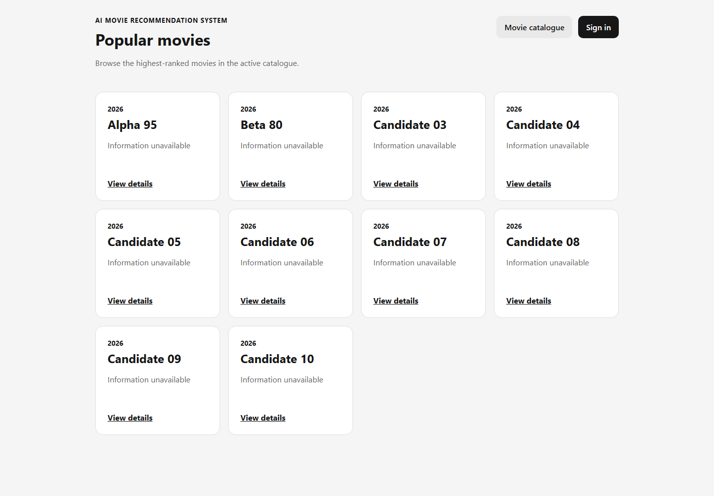
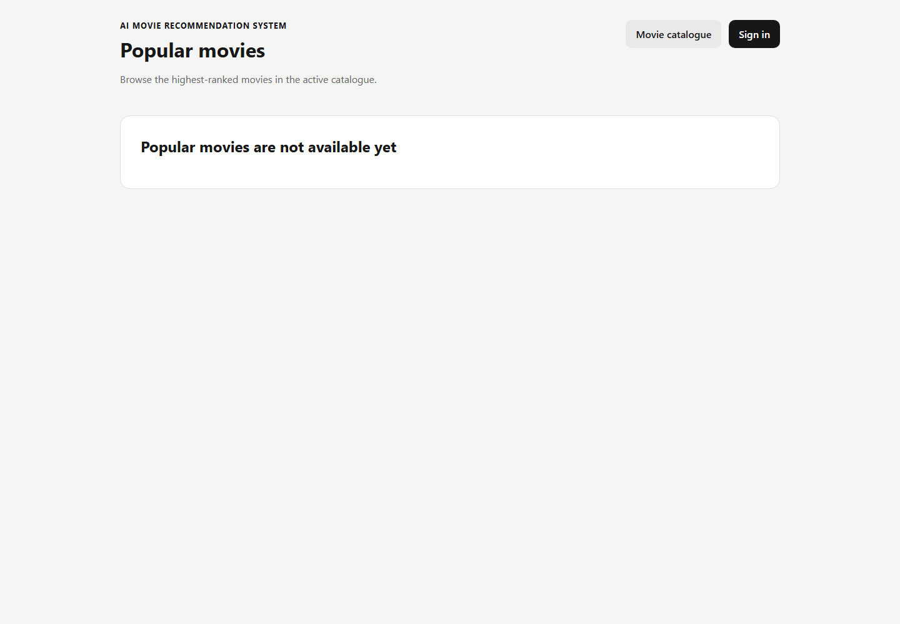

# S3-T21 S09 popular-movie acceptance evidence

Test date: 2026-10-10 (Asia/Saigon)

- Parent Story: [#31](https://github.com/SE-FDA-NEU/ai66a_group3_C1_SE/issues/31) (reference only; do not close the Story from this task)
- Backend dependency: [PR #145](https://github.com/SE-FDA-NEU/ai66a_group3_C1_SE/pull/145)
- UI dependency: [PR #148](https://github.com/SE-FDA-NEU/ai66a_group3_C1_SE/pull/148)
- Tested candidate after merging `main`: [`eaa41371b78e7bbba4b6328693bd6fe3af505fd2`](https://github.com/kietxuan/ai66a_group3_C1_SE/commit/eaa41371b78e7bbba4b6328693bd6fe3af505fd2)
- Pre-run working tree: clean; the acceptance runner then refreshed the tracked evidence files
- Independent review: pending until a T21 pull request is opened
- Scope: testing and evidence only; no production application code changed

## Files in scope

| File | Purpose |
|---|---|
| `backend/tests/test_movies_api.py` | Uses exactly eleven ranked movies and asserts the complete expected top-ten order plus exclusion of number eleven. |
| `frontend/src/tests/popular-movies.test.tsx` | Asserts the no-popularity UI message with an exact full-string match and zero cards. |
| `backend/scripts/verify_s09_popular_ui.py` | Creates a migrated file-backed SQLite DB, starts FastAPI and Vite, renders `/popular` in Chromium, and asserts all three S09 criteria through the real UI. |
| `docs/evidence/s3-t21-popular-acceptance/` | Reproducible command output and screenshots from the real-DB UI run. |

## Acceptance setup

The acceptance runner creates a new SQLite file in an operating-system temporary directory and applies the real Alembic migrations. It inserts two deterministic catalogue revisions:

1. An active revision with exactly eleven finite-popularity movies. `Alpha 95` has score 95, `Beta 80` has score 80, and `Excluded 11` is the lowest-ranked movie.
2. An inactive revision with two movies whose popularity values are `NULL`. The runner activates this revision only after the ranked-list checks pass.

It then starts the real FastAPI server on port 8000 and Vite on port 5173. A fresh guest Chromium profile opens `/popular`; no authentication cookie, mocked fetch, live TMDb request, or development database is used. The temporary database and browser profiles are removed after the run.

Environment recorded by `t21-browser-run-output.txt`:

```text
Python 3.12.3
Node v24.20.0
Google Chrome executable: C:\Program Files\Google\Chrome\Application\chrome.exe
Database: migrated temporary file-backed SQLite
```

## Acceptance results

| Story criterion | Automated assertion | Actual result |
|---|---|---|
| Top ten from eleven correct | API titles and rendered movie-card headings must equal the expected ten-item list; `Excluded 11` must be absent. | PASS: 10 cards in the expected order; the eleventh movie was absent. |
| 95 before 80 | The rendered index of `Alpha 95` must be lower than the index of `Beta 80`. | PASS: `Alpha 95` was first and `Beta 80` was second. |
| Exact empty message | The empty revision must return `200` with zero movies; the UI must have zero cards and exactly one status heading equal to `Popular movies are not available yet`. | PASS: exact text matched and zero cards were rendered. |

Full machine-readable output is in `t21-browser-run-output.txt`. The backend output records the browser's real proxied requests to `/api/movies/popular?limit=10`.





## Test commands and results

| Command | Result |
|---|---|
| `python backend/scripts/verify_s09_popular_ui.py --evidence-dir docs/evidence/s3-t21-popular-acceptance` | PASS; migrated real DB, real API, Vite UI and headless Chromium |
| `python -m pytest backend/tests/test_movies_api.py -k popular -v -p no:cacheprovider` | 7 passed, 10 deselected, 1 existing deprecation warning |
| `npm --prefix frontend test -- src/tests/popular-movies.test.tsx --reporter=verbose` | 1 file passed; 6 tests passed |
| `python -m pytest backend/tests -v -p no:cacheprovider` | 135 passed, 2 skipped, 1 existing deprecation warning |
| `npm --prefix frontend test -- --reporter=verbose` | 6 files passed; 47 tests passed |
| `python -m ruff check backend` | All checks passed |
| `npm --prefix frontend run lint` | Exit code 0 |
| `npm --prefix frontend run build` | Exit code 0; 41 modules transformed |

The two backend skips are existing placeholders for rating-write and cross-account personalised-recommendation work. They are unrelated to S09/T21.

## Reviewer steps

1. Check out the T21 candidate commit and confirm that ports 8000 and 5173 are free.
2. Install the locked project dependencies if needed: `python -m pip install -r backend/requirements.lock.txt` and `npm --prefix frontend ci`.
3. Run the focused API test: `python -m pytest backend/tests/test_movies_api.py -k popular -v -p no:cacheprovider`.
4. Run the focused UI test: `npm --prefix frontend test -- src/tests/popular-movies.test.tsx --reporter=verbose`.
5. With Chrome, Chromium, or Edge installed, run `python backend/scripts/verify_s09_popular_ui.py --evidence-dir docs/evidence/s3-t21-popular-acceptance`. If auto-detection is unavailable, append `--browser <absolute-browser-path>`.
6. Confirm that the runner reports `result=PASS`, compare the two generated screenshots, and verify that no `s09-t21-*` temporary directory remains.
7. Run the full regression and quality commands from the table above.
8. Approve the PR independently, then replace the pending candidate/review entries with permanent GitHub links before closing T21.

## Explicitly pending or unimplemented

- Unimplemented S09 criteria in T21 scope: **none**. All three criteria listed above pass through the real database and UI.
- Tested candidate commit: linked above; the post-merge acceptance and focused suites pass against it.
- Independent review link: pending because no T21 PR has been opened.
- Story-wide closure: intentionally not claimed. Keep #31 open until its complete AC-to-task matrix and Definition of Done pass.
