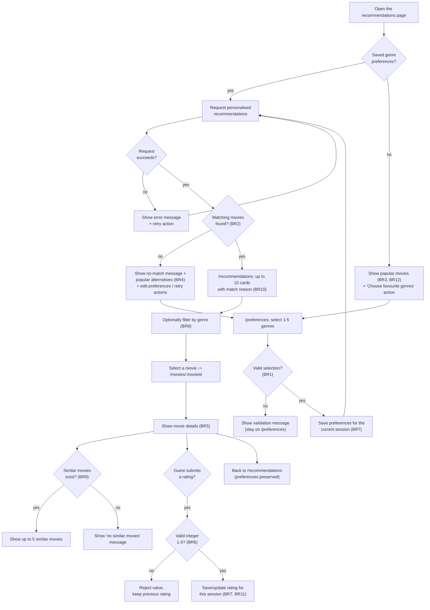

# M1 requirements dossier - AI Movie Recommendation System

This is the Sprint 1 deliverable for Milestone 1 (Refs #14). It pulls
together the requirements work already done for C01 and C03 into the seven
sections the M1 brief asks for. Where the detail already lives in another
file (the personas, the user research, the backlog decisions), this
document links to it instead of copying it, so there is only one place to
keep each fact up to date.

## 1. Project description

The AI Movie Recommendation System is for people who spend too long picking
a movie. A guest tells the system which genres they like and gets back a
short list of movies, each with a stated reason, instead of an endless
catalogue to scroll through.

The initial users are university students aged 18 to 20, since that is who
answered the 8-response survey in `docs/user-research.md`. That is also the
only group the team has real evidence about. Two patterns showed up in the
answers and became the two personas in section 7: someone who watches often
and gets overwhelmed by choice, and someone who watches rarely and does not
know where to start.

The evidence for the problem is direct: 6 of 8 respondents said having too
many movies available made it hard to decide, and 6 of 8 had either spent
at least 15 minutes choosing a movie or given up and rewatched an old one.
The product needs to narrow that choice down to a short, explained list
rather than add more movies to an already large catalogue. A guest without
any saved preferences still sees popular movies rather than a blank page,
and a guest whose genres do not match anything gets popular alternatives
instead of a dead end. The full scope and what is deliberately left out of
the MVP is recorded in `docs/product-scope.md`.

## 2. Main features

| Feature | Story | Priority | Issue |
|---|---|---|---|
| F1: Select favourite genres | S01 | P0 | [#17](https://github.com/SE-FDA-NEU/ai66a_group3_C1_SE/issues/17) |
| F2: Personalised recommendations with a match reason | S02 | P0 | [#18](https://github.com/SE-FDA-NEU/ai66a_group3_C1_SE/issues/18) |
| F3: View essential movie details | S03 | P0 | [#19](https://github.com/SE-FDA-NEU/ai66a_group3_C1_SE/issues/19) |
| F4: Explore popular movies with no preferences yet (cold start) | S04 | P0 | [#20](https://github.com/SE-FDA-NEU/ai66a_group3_C1_SE/issues/20) |
| F5: Rate a movie and save the feedback | S05a | P1 | [#21](https://github.com/SE-FDA-NEU/ai66a_group3_C1_SE/issues/21) |
| F6: Use ratings to improve later recommendations | S05b | P1 | [#22](https://github.com/SE-FDA-NEU/ai66a_group3_C1_SE/issues/22) |
| F7: Filter recommendations by genre | S06 | P0 | [#23](https://github.com/SE-FDA-NEU/ai66a_group3_C1_SE/issues/23) |
| F8: Find similar movies from the details page | S07 | P1 | [#24](https://github.com/SE-FDA-NEU/ai66a_group3_C1_SE/issues/24) |

These priorities come from the PO's backlog refinement after reading the
survey results (`docs/backlog-refinement.md`, dated 2026-09-17 in
`docs/changelog.md`). Genre filtering (F7) moved from P1 to P0 because
genre-related features scored highest in the survey. F5 and F6 stayed P1
because nobody in the survey rated movies often, so rating cannot be
something the MVP depends on. F1 through F4 and F7 make up the MVP path
described in `docs/product-scope.md`. F5, F6 and F8 are worth having, but
the product still works without them.

The movie-data spike ([#16](https://github.com/SE-FDA-NEU/ai66a_group3_C1_SE/issues/16))
has not reported back yet. Its answer affects what F2, F4 and F6 can
actually do; see BR11 and BR12 below.

## 3. Business rules

Twelve rules, numbered so a story, a test, or this dossier can all point at
the same thing. None of these are invented for this document: each one is
already named or implied in the acceptance criteria of the issue(s) listed
next to it.

| # | Rule | Source issue(s) |
|---|---|---|
| BR1 | A guest picks between 1 and 5 favourite genres before getting personalised recommendations. | #17 |
| BR2 | A recommended movie has to match at least one of the guest's selected genres. | #18, #22 |
| BR3 | A guest with no saved preferences can still see popular movies. | #20 |
| BR4 | If nothing matches the selected genres, show an empty-state message, popular alternatives, and a way to edit preferences. | #18, #20 |
| BR5 | Every movie has a unique ID, which is how its details page gets opened. | #19 |
| BR6 | A valid rating is a whole number from 1 to 5; any other value is rejected. | #21 |
| BR7 | Preferences and ratings belong only to the current session; one session cannot see another's. | #17, #21 |
| BR8 | The genre filter shows only the selected genre from the list already on screen and does not change the saved preferences. | #23 |
| BR9 | Similar movies share a genre with the original and never include the original itself. | #24 |
| BR10 | A recommendation result has no duplicate movies and never more than 10. | #18, #22 |
| BR11 | A rating of 4 to 5 counts as a positive signal, 1 to 2 as negative, and 3 as neutral, when future recommendations are ranked. | #22, #16 |
| BR12 | Popular and fallback movies are ordered by whatever popularity criterion the team agrees on; the exact criterion still depends on the data-source spike (#16). | #20, #16 |

## 4. Screen list

There are no user accounts in the MVP (see the scope constraints in
`docs/product-scope.md`), so every screen below is open to guests (`G`).

| Route | Purpose | Access | Priority | Feature(s) | Story issue(s) |
|---|---|---|---|---|---|
| `/` | Entry point: start the flow, or land here as a returning guest. | G | P0 | F1, F4 | #17, #20 |
| `/preferences` | Pick 1 to 5 favourite genres (BR1); come back later and change them. | G | P0 | F1 | #17 |
| `/recommendations` | Up to 10 personalised or popular movies with a match reason (BR2, BR4, BR10, BR12); filter the list by genre (BR8). | G | P0 | F2, F4, F7 | #18, #20, #23 |
| `/movies/:movieId` | Movie details (BR5), rating (BR6, BR7), and up to 5 similar movies (BR9). | G | P0 for details, P1 for rating and similar movies | F3, F5, F6, F8 | #19, #21, #22, #24 |

## 5. Screen flow

The original diagram is `docs/screen-flow.puml`. The Mermaid version below
redraws the same flow so it renders directly on GitHub without a PlantUML
viewer. It keeps the same success path and the same error, empty-state,
retry and back-navigation branches; nothing is added or removed.

The empty state shows up twice: once for a guest with no preferences at all
(node D) and once for a guest whose genres do not match anything (node L).
Both give the guest something to do next instead of a dead end. A failed
recommendation request (I to J) does not discard the guest's selected
genres; it offers retry, and retrying re-runs the same request (J to C),
which is what #18's acceptance criteria ask for. Going from a movie's
details page back to the recommendation list keeps the session's
preferences and list state intact, per the last acceptance criterion on
#19.

## 6. Traceability

[`docs/traceability.md`](traceability.md) is the one table that maps every
route above to its feature(s) and real issue number(s). It is kept as a
single file so there is only one place to update the mapping. Nothing in
this dossier names a route, feature, or issue number that is not already
in that table.

## 7. Team and personas

### Team

| Name | GitHub username | Role |
|---|---|---|
| Nguyen Xuan Kiet | [kietxuan](https://github.com/kietxuan) | Product Owner, fixed for the whole term |
| Minh Hoàng Trần | [hoang3003](https://github.com/hoang3003) | Scrum Master for Sprint 1 |
| Tran Tuan Anh | [anotify-vie](https://github.com/anotify-vie) | Dev: led C03's persona and user-research work; assigned S05a (#21) |
| Nguyen Tuan Anh | [NguyenTuanAnh0608](https://github.com/NguyenTuanAnh0608) | Dev: owns C05's repository review; assigned S03 (#19) |
| Vũ Quốc Huy | [vu-huzy](https://github.com/vu-huzy) | Dev: owns C04, this dossier; assigned S04 (#20) and S07 (#24) |

kietxuan is the Product Owner for the whole term, and hoang3003 is Sprint
1's Scrum Master, a role that rotates each sprint per `docs/process.md`.
That document also explains why: the team creates two mandatory chore
issues each sprint, one for backlog refinement assigned to the PO and one
for sprint wrap-up assigned to that sprint's Scrum Master. C01 (refine the
backlog) went to kietxuan and C02 (Sprint 1 wrap-up) went to hoang3003,
matching the roles above. README does not list these roles yet; updating
it belongs to C05 (#15, still open), not to this dossier.

README also spells Minh Hoàng Trần's GitHub username as `minhhoang3003`,
but every issue assignment (#17, #20, #22, #12) points to `hoang3003`.
That should be corrected as part of C05.

### Personas

The full write-up, with pain points and the survey evidence behind each
one, is in [`docs/personas.md`](personas.md); the raw numbers are in
[`docs/user-research.md`](user-research.md). In short:

The Frequent Explorer persona watches movies at least twice a week (4 of 8
respondents fit this pattern) and wants a short, explained list instead of
scrolling through a popular-movies page again. This persona is behind F1,
F2, F3, F7 and F8.

The Occasional Undecided Viewer persona does not watch often and does not
know where to start when the app opens. This persona needs popular movies
to show up with no setup required, an obvious way into picking genres, and
should never be forced to rate anything just to keep using the product.
This persona is behind F1, F2, F4 and F5.

Both are behaviour patterns pulled from the same anonymous 8-response
survey, not descriptions of specific people. The sample is small and
entirely university students aged 18 to 20, so these personas are good
enough to steer the MVP, but they should not be read as representing every
movie viewer. That limitation is spelled out in `docs/user-research.md` as
well.
