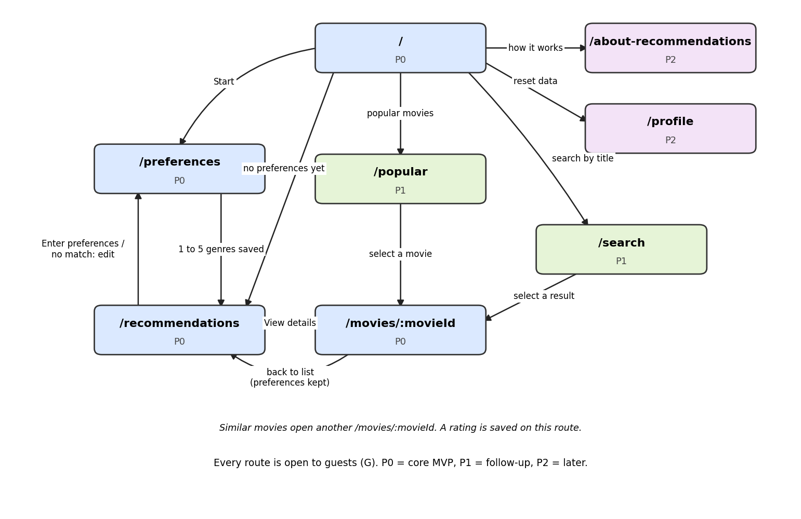

# M1 requirements document - AI Movie Recommendation System

This document covers the six sections required for Milestone 1. It draws on
the research in `docs/user-research.md`, the personas in `docs/personas.md`,
the scenarios in `docs/scenarios.md`, the scope in `docs/product-scope.md`,
and the twelve Story issues on GitHub (#17 to #24 and #30 to #33). Route
mapping is kept in `docs/traceability.md`.

## 1. Product vision

For university students facing choice overload, the AI Movie Recommendation
System turns a small set of genre preferences and optional ratings into
transparent movie recommendations, unlike a generic popularity list that
gives every viewer the same choices.

## 2. Personas

Interview note: the personas are based on an anonymous questionnaire with 8 valid
responses from university students aged 18 to 20, recorded in
`docs/user-research.md` on 2026-09-17. No individual conversations are
recorded in the repository. The quoted sentences are verbatim free-text
answers from the questionnaire, translated from Vietnamese, and are not
attributed to named people.

### Persona 1: Frequent Explorer

Role: a student who watches movies at least twice a week.

Goal: find a relevant movie quickly when there are many possible choices.

Blocked by: too many movies to decide between, and recommendations that feel
unrelated to current interests. This persona may know a preferred genre and
still struggle to find a suitable title.

In their words: "I want to watch a detective movie but I can't see any that
fit my taste right then."

Evidence: 4 of 8 respondents watch at least twice a week, 6 of 8 reported
choice overload, and favourite genres, personalised recommendations and
genre filtering each scored 4.125 out of 5.

### Persona 2: Occasional Undecided Viewer

Role: a student who watches movies rarely and does not know what to search
for when opening a movie service.

Goal: start exploring immediately and find a reasonable movie without
building a full preference profile first.

Blocked by: not knowing where to start, spending a long time choosing, and
getting no suitable result after picking a genre. This persona may give up,
rewatch an old movie, or choose at random.

In their words: "I usually give up or rewatch an old movie."

Evidence: 4 of 8 respondents watch less than once a month, 5 of 8 wanted both
popular movies and genre selection when no preferences exist, 6 of 8 preferred
popular alternatives after a no-match result, and no respondent rated movies
frequently.

### Persona 3: Detail-Oriented Chooser

Role: a student who has a rough idea of what to watch but needs more
information before deciding.

Goal: confirm that a recommended movie suits them before committing to it.

Blocked by: not knowing whether a movie fits their current interests or mood,
recommendations that look relevant without enough information to trust them,
and no easy way to find similar options after liking a title.

In their words: "After watching one good movie I wanted another with exactly
the same content, but I couldn't find one."

Evidence: 5 of 8 respondents were unsure whether a movie would suit their
current mood, 6 of 8 named genre as important before choosing, and viewing
similar movies scored 3.625 out of 5.

## 3. Scenarios

Both scenarios are taken from `docs/scenarios.md`. They describe a complete
use of the system in plain language and name no screens or buttons.

### Scenario 1: A Frequent Explorer finds a movie from existing preferences

1. The Frequent Explorer wants to find a new movie without spending a long
   time browsing.
2. They return to the service after having saved several favourite genres
   earlier.
3. They receive a short list of movies related to those genres.
4. They read why each suggested movie is relevant to their interests.
5. They narrow the list to the genre they want to watch at that moment.
6. They choose an interesting movie and read its year, genres and overview.
7. They decide the movie is not quite suitable and look at similar
   alternatives.
8. They find a more suitable movie and decide to watch it.

### Scenario 2: An Occasional Undecided Viewer explores without preferences

1. The Occasional Undecided Viewer wants to watch a movie but does not know
   what to search for.
2. They begin by looking through a ranked selection of popular movies.
3. They decide to provide several favourite genres to receive more relevant
   suggestions.
4. They receive a short list based on those selected genres.
5. No suitable recommendation is available for the current preferences.
6. They receive popular alternatives instead of reaching a dead end.
7. They adjust their selected genres and try again.
8. They receive matching recommendations and choose a movie to explore
   further.

## 4. User stories

Points are the estimates recorded on each GitHub issue. Five stories are P0,
five are P1 and two are P2.

| ID | Story | Priority | Points | Issue | Route |
|---|---|---|---|---|---|
| S01 | Select favourite genres to start choosing a movie | P0 | 3 | #17 | `/`, `/preferences` |
| S02 | Get a movie list based on preferences | P0 | 5 | #18 | `/recommendations` |
| S03 | View movie details before deciding | P0 | 3 | #19 | `/movies/:movieId` |
| S04 | Explore movies without preferences | P0 | 5 | #20 | `/`, `/recommendations` |
| S05a | Rate a movie and save feedback | P1 | 3 | #21 | `/movies/:movieId` |
| S05b | Use movie ratings to improve recommendations | P1 | 5 | #22 | `/movies/:movieId`, `/recommendations` |
| S06 | Filter recommendations by genre | P0 | 3 | #23 | `/recommendations` |
| S07 | Find similar movies from the details page | P1 | 3 | #24 | `/movies/:movieId` |
| S08 | Search for a movie by title | P1 | 3 | #30 | `/search` |
| S09 | Browse popular movies | P1 | 3 | #31 | `/popular` |
| S10 | Learn how recommendations are personalised | P2 | 3 | #32 | `/about-recommendations` |
| S11 | Reset my personalisation profile | P2 | 3 | #33 | `/profile` |

The full acceptance criteria stay on the GitHub issues. The criteria below
are the ones each story is checked against.

### S01 Select favourite genres (P0, 3 points)

As someone who wants to choose a movie quickly, I want to select my favourite
genres so that I can receive relevant recommendations without viewing history.

- Given I select 1 to 5 valid genres, when I confirm, then the choices are
  saved for the current session and I am taken to the recommendations.
- Given I have not selected any genre, when I confirm, then I am asked to
  select at least one genre and stay on the same page.
- Given I have selected 5 genres, when I try to select a sixth, then the limit
  is shown and the previous 5 selections are kept.
- Given the session already has preferences, when I return to edit them, then
  my current selections are shown and an independent session cannot see them.

### S02 Get a movie list based on preferences (P0, 5 points)

As a viewer with selected favourite genres, I want personalised
recommendations with clear matching reasons so that I can narrow down what to
watch.

- Given valid genres are selected and matching movies exist, when
  recommendations are requested, then up to 10 distinct movies are shown and
  each matches at least one selected genre.
- Given results are displayed, when I view a movie card, then it shows the
  title, the genres, and a reason that names at least one matching selected
  genre.
- Given no movie matches the selected genres, when recommendations are
  requested, then a no-match message, up to 10 popular alternatives, and
  actions to change preferences or retry are shown.
- Given the recommendation source fails, when recommendations are requested,
  then an error message and a retry action are shown and the selected
  preferences stay unchanged.

### S03 View movie details before deciding (P0, 3 points)

As someone considering a movie, I want to view detailed information so that I
can decide whether to watch it.

- Given a movie card has a valid ID, when I select View details, then the
  title, year, genres and summary are displayed.
- Given the movie ID does not exist, when I open the details address, then
  "Movie not found" and a link back to the movie list are shown.
- Given the movie has no summary or year, when I open its details, then
  "Information unavailable" is shown for the missing field and the other
  fields are still displayed.
- Given I am viewing details, when I return to the list, then the session
  preferences are preserved.

### S04 Explore movies without preferences (P0, 5 points)

As a new user, I want guidance and popular movies to explore so that I am not
stuck on an empty screen before entering my preferences.

- Given a new session has no preferences and the fallback data holds Movie A
  with popularity 90, Movie B with 80 and Movie C with 80, when I open the
  recommendations, then Movie A appears first, Movies B and C follow in title
  order, at most 10 movies are shown, and they are marked as not personalised.
- Given I am viewing the fallback list, when I select Enter preferences, then
  I am taken to the genre selection.
- Given the popular movie data is empty, when I open the recommendations in a
  new session, then a no-data message and guidance to enter preferences are
  shown and no fake movies are displayed.

### S05a Rate a movie and save feedback (P1, 3 points)

As a viewer who has watched a movie, I want to give and update a rating so
that I can save my feedback.

- Given I open a valid movie, when I submit an integer rating from 1 to 5,
  then the system confirms the rating was saved and shows my current rating.
- Given I have already rated the movie in this session, when I change the
  rating, then only one current rating is kept for that movie.
- Given I submit 0, 6 or a non-integer rating, when it is processed, then the
  value is rejected and any earlier rating is kept.
- Given saving fails, when I submit a valid rating, then the system says the
  rating was not saved, keeps the selected value for retry, and shows no
  success message.
- Given I have not rated any movie, when I request recommendations, then the
  recommendation flow still works.

### S05b Use movie ratings to improve recommendations (P1, 5 points)

As a viewer who has provided ratings, I want future recommendations to use my
feedback so that they become more relevant.

- Given an Action candidate and a Comedy candidate both have popularity 80,
  when I have rated an Action movie 5 and request recommendations again, then
  the Action candidate appears above the Comedy candidate.
- Given the same two candidates, when I have rated an Action movie 1, then the
  Comedy candidate appears above the Action candidate.
- Given an Action candidate has popularity 90 and a Comedy candidate has 80,
  when I rate an Action movie 3, then the Action candidate stays above the
  Comedy candidate because 3 is neutral.
- Given ratings affect the ranking, when recommendations are generated, then
  at most 10 different movies are returned.

### S06 Filter recommendations by genre (P0, 3 points)

As someone choosing a movie, I want to filter recommendations by genre so that
I can focus on what I want to watch now.

- Given the list holds exactly 2 Action movies and 3 Comedy movies, when I
  select the Action filter, then exactly the 2 Action movies are shown and no
  Comedy movie.
- Given the selected genre has no movie in the list, when I apply the filter,
  then no results are shown together with a clear way to remove the filter.
- Given a filter is active, when I remove it, then the original list returns
  and the saved preferences are unchanged.

### S07 Find similar movies from the details page (P1, 3 points)

As someone interested in a movie, I want to see similar movies so that I can
explore more options without starting the search again.

- Given the original movie has other movies that share a genre, when I view
  the Similar movies section, then up to 5 different movies are shown, none is
  the original, and each shares at least one genre with it.
- Given no suitable candidate exists, when I open the section, then a message
  says no similar movies are available and the original details stay visible.
- Given similar movies are displayed, when I select one, then its details page
  opens.

### S08 Search for a movie by title (P1, 3 points)

As a viewer who already knows a movie title, I want to search the catalogue by
title so that I can find it without browsing a long list.

- Given the catalogue contains "Inception", when I search for "Inception",
  then the results include "Inception".
- Given a search returns more than 10 matches, when the results are displayed,
  then only the first 10 are shown.
- Given I enter fewer than 2 characters, when I submit, then the system shows
  "Enter at least 2 characters".

### S09 Browse popular movies (P1, 3 points)

As an undecided viewer, I want to browse a ranked list of popular movies so
that I can start choosing even when I have not set preferences.

- Given the catalogue has at least 10 movies with popularity values, when I
  open the list, then the 10 highest-ranked movies are displayed.
- Given two movies have popularity 95 and 80, when the list is displayed, then
  the movie with 95 appears before the movie with 80.
- Given no popularity data is available, when I open the list, then the system
  shows "Popular movies are not available yet".

### S10 Learn how recommendations are personalised (P2, 3 points)

As a viewer, I want a short explanation of how my genres and ratings affect
recommendations so that I can decide whether to provide preference data.

- Given I open the explanation, when the page loads, then it explains the
  process in exactly 3 steps: choose genres, receive recommendations, and
  optionally rate movies.
- Given I have not submitted any genres or ratings, when I read the
  explanation, then it states "You can browse popular movies without
  providing preferences".

### S11 Reset my personalisation profile (P2, 3 points)

As a viewer, I want to reset my saved genres and ratings so that I can start
receiving recommendations without previous preference data.

- Given my profile holds 3 selected genres and 2 ratings, when I confirm the
  reset, then it holds 0 genres and 0 ratings.
- Given I select reset but do not confirm, when I return to my profile, then
  my genres and ratings are unchanged.
- Given the reset succeeds, when the operation finishes, then the system shows
  "Your personalisation profile was reset".

## 5. Business rules

Rule numbers follow the routes and stories mapped in `docs/traceability.md`.
Each rule is a constraint the system enforces.

| ID | Rule | Worked example | Stories | Routes |
|---|---|---|---|---|
| BR1 | A viewer selects between 1 and 5 favourite genres. | Choosing Action, Comedy and Drama (3 genres) is accepted. A sixth genre after 5 is refused and the 5 stay selected. Confirming with 0 genres is refused. | S01 | `/`, `/preferences` |
| BR2 | A recommended movie matches at least one selected genre. | Movie 7 is tagged Action and Comedy and movie 9 is tagged Drama. With Action selected, only movie 7 (1 of 2) can be recommended. | S02, S05b | `/recommendations` |
| BR3 | A recommendation list has no duplicates and at most 10 movies. | If 12 movies match, 10 are shown. A movie that matches 2 selected genres appears once. | S02, S05b | `/recommendations` |
| BR4 | When nothing matches, the viewer sees a no-match message, up to 10 popular alternatives, and actions to change preferences or retry. | The selected genres match 0 movies, so the page shows the message and 10 popular movies instead of an empty list. | S02, S04 | `/recommendations` |
| BR5 | Popular movies are ordered by popularity score from highest to lowest, equal scores by title from A to Z, and at most 10 are shown. | Movie A scores 90, Movie B 80 and Movie C 80. The order is A, B, C. | S04, S09 | `/`, `/recommendations`, `/popular` |
| BR6 | Every movie has a unique ID that opens its details page. | The card with ID 42 opens the details of movie 42. An ID that does not exist shows "Movie not found". | S03 | `/movies/:movieId` |
| BR7 | A rating is a whole number from 1 to 5. | 1 and 5 are accepted. 0, 6 and 3.5 are rejected and an earlier rating is kept. | S05a | `/movies/:movieId` |
| BR8 | Saved genres and ratings belong to the current session only. | Session X rates a movie 4. Session Y opens the same movie and sees no rating. | S01, S05a, S11 | `/preferences`, `/movies/:movieId`, `/profile` |
| BR9 | A rating of 4 or 5 is a positive ranking signal, 1 or 2 is negative, and 3 is neutral. | Two candidates both score 80. After an Action movie is rated 5, Action ranks above Comedy. After a rating of 1, Comedy ranks above Action. With scores of 90 and 80, a rating of 3 leaves the order unchanged. | S05b | `/movies/:movieId`, `/recommendations` |
| BR10 | The genre filter shows only the chosen genre from the current list and leaves saved preferences unchanged. | A list of 2 Action and 3 Comedy movies shows exactly 2 movies under the Action filter and 5 again once the filter is removed. | S06 | `/recommendations` |
| BR11 | Similar movies share at least one genre with the original, exclude the original, and number at most 5. | A movie has 7 candidates that share a genre. 5 are shown and the original is not among them. | S07 | `/movies/:movieId` |
| BR12 | A title search needs at least 2 characters and shows at most 10 matches. | Searching "I" shows "Enter at least 2 characters". Searching "In" with 14 matching titles shows 10. | S08 | `/search` |
| BR13 | The recommendation explanation has exactly 3 steps. | The page lists 3 steps: choose genres, receive recommendations, optionally rate movies. | S10 | `/about-recommendations` |
| BR14 | Resetting the profile needs confirmation and clears all saved genres and ratings. | A profile with 3 genres and 2 ratings holds 0 and 0 after confirming. Without confirming it still holds 3 and 2. | S11 | `/profile` |

## 6. Screens and flow

There are no user accounts in the MVP, so every screen is open to guests (G).

| Route | Purpose | Access | Priority |
|---|---|---|---|
| `/` | Start choosing genres, or see non-personalised popular movies when there are no preferences. | G | P0 |
| `/preferences` | Select, save and revisit 1 to 5 favourite genres. | G | P0 |
| `/recommendations` | Show personalised movies, the no-match fallback, cold-start results and the genre filter. | G | P0 |
| `/movies/:movieId` | View movie details, rate the movie and see similar movies. | G | P0 for details, P1 for rating and similar movies |
| `/search` | Search the catalogue by title. | G | P1 |
| `/popular` | Browse the ranked popular-movie list. | G | P1 |
| `/about-recommendations` | Explain in 3 steps how genres and ratings affect recommendations. | G | P2 |
| `/profile` | Confirm and reset saved genres and ratings. | G | P2 |

Every route is reachable from `/`. A viewer with no preferences sees popular
movies on `/recommendations` with an action to open `/preferences`. A viewer
whose genres match nothing sees popular alternatives with actions to edit
preferences or retry. A failed recommendation request shows an error and a
retry action. Going back from `/movies/:movieId` returns to
`/recommendations` with the preferences kept, and an unknown movie ID shows
"Movie not found" with a link back to the list.
